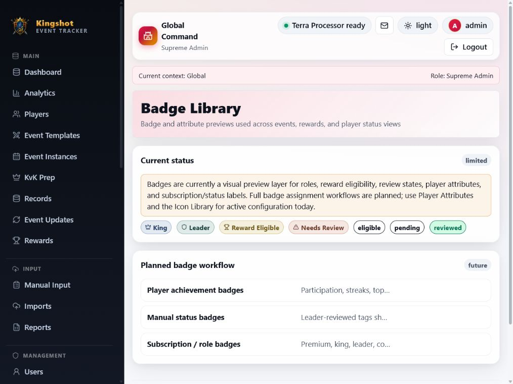
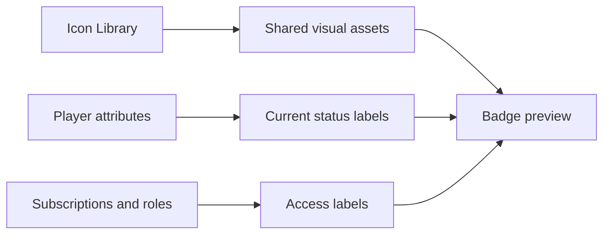

# Badges

> **Current status: limited preview.** The page is intentionally honest about its scope.

Badges currently provide a visual preview of role, reward-eligibility, review-state, player-attribute, and subscription/status labels. They are not yet a dedicated badge assignment or CRUD feature.

## What is active today

- Player attributes and statuses can create badge-like labels in relevant player and analytics views.
- Subscription, role, and review state labels communicate access/status.
- The Icon Library remains the active configuration feature for shared visual assets.

## What is not active

- No standalone badge creation, assignment, bulk assignment, or deletion workflow exists.
- Do not rely on this page as evidence that an achievement/reward-badge system has been implemented.

## Visual relationship

For existing configuration, see [Icons (and Badges)](/admin/icons-and-badges) and [Player Attributes](/how-to/manual-attributes).
