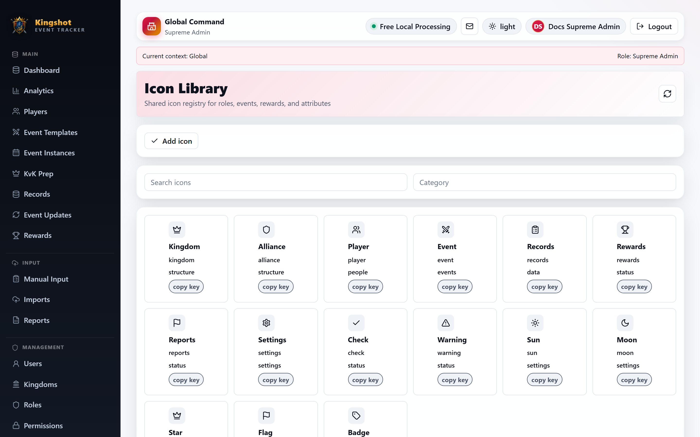

# Icons (and Badges)

This guide is for `Supreme Admin` users only.

The current admin UI has a real **Icons** library, but the **Badges** page is only a preview area right now, not a full badge-management screen.

## What currently works

The **Icons** page is usable today.

You can:

- browse the shared icon library
- search icons
- filter by category
- copy an icon key for reuse elsewhere
- create a custom icon
- edit a custom icon
- delete a custom icon

## System icons vs custom icons

There are two icon types in practice:

- built-in system icons
- custom icons you add yourself

System icons are locked:

- they can be reviewed
- their keys are reserved
- they cannot be deleted

If you want a variation, create a custom alternative instead.

## Creating a custom icon

The create and edit form lets you set:

- key
- label
- category
- type
- value
- color

Supported icon types are:

- `emoji`
- `svg`
- `image_url`

The page also shows a live preview before you save.

## Safety checks

The icon system validates custom values.

For example:

- image URLs must be real `http` or `https` URLs
- unsafe SVG content is rejected

That helps keep the shared icon registry safe to reuse across the app.

## Where icons are used

This shared icon library feeds places such as:

- roles
- events
- rewards
- player attributes and status displays

## What I found about the badges page

The current **Badges** admin route is only a small preview page showing sample badges and attribute chips. It does **not** currently provide badge CRUD or a real badge-management workflow.

So, today:

- icon management is live
- badge management is not yet available as a real admin interface

If you need badge-like changes today, look at the settings and status systems that already exist elsewhere in the app rather than expecting a dedicated badge editor here.

## Related

- [Create & Edit Custom Roles](manage-roles.md)
- [Permission Reference](../reference/permission-catalog.md)
