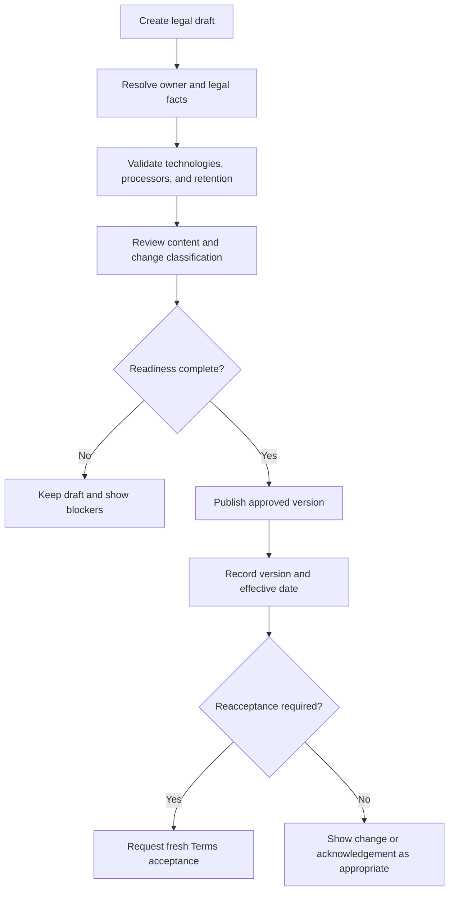
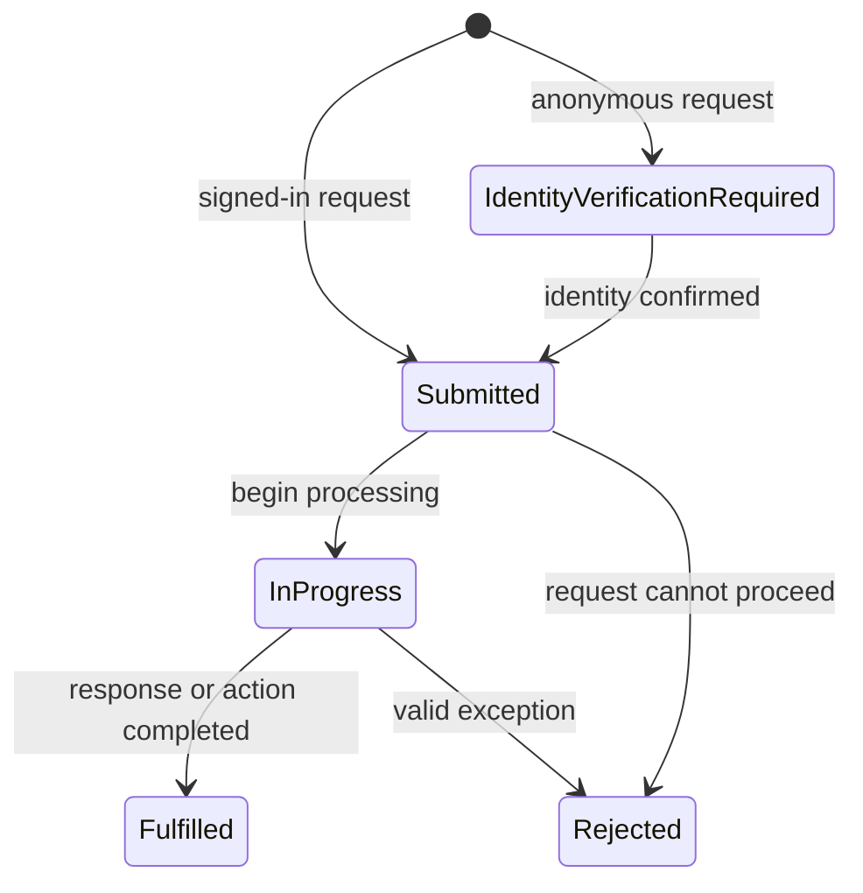

# Legal, Consent, and Data Rights Administration

> This page explains product operation. It is not legal advice. Facts marked for owner confirmation or legal review must remain unpublished or clearly unresolved until the appropriate person confirms them.

## Legal Center

The Legal Center contains versioned:

- Terms of Service;
- Privacy Notice;
- Cookie and Storage Technologies Policy;
- Acceptable Use Policy;
- Community Guidelines;
- Data Rights guide.

Each version records its publication state, effective date, change summary, affected products and regions, and whether a material change requires reacceptance.

The platform, Portal, and Kingshot Events can add product-specific supplements to the shared policy.

## Publication workflow

## Consent categories

Strictly necessary processing remains available because authentication, CSRF protection, legal records, and security cannot depend on optional consent.

Optional categories are:

- functional;
- analytics;
- personalization;
- advertising.

The preference record includes region, signal source, Global Privacy Control, and change history.

Do not treat rejection of optional technology as rejection of the service itself.

## Inventory review

Check every active technology and processor for:

- public name and provider;
- purpose and data categories;
- affected products;
- storage type and duration;
- processing location;
- agreement status;
- transfer mechanism;
- retention behavior;
- privacy policy reference;
- evidence location.

Package installation alone does not prove that a processor is active. Configuration-dependent services must stay identified as such.

## Data-rights request lifecycle

Users can submit requests at `/data-rights` or track them in `/privacy-data`.

The administrator queue at `/admin/privacy-requests` supports:

- pagination;
- status filtering;
- search;
- request and account context;
- response text;
- internal handling details;
- deadline and status updates.

The administrator controls expose submitted, in progress, fulfilled, and rejected states. Anonymous submissions begin with identity verification. Changes remain available in the request history.

## Fulfillment checklist

1. Confirm the request type, region, product, and deadline.
2. Verify identity proportionately before disclosing or changing personal data.
3. Identify the affected account, player, upload, analytics, support, subscription, Knowledge, and audit records.
4. Apply documented retention, fraud, security, billing, and legal exceptions.
5. Keep internal notes separate from the public response.
6. Record the decision and status.
7. Deliver the response through the approved contact route.
8. Preserve the request event history.

## Public routes

| Route | Purpose |
|---|---|
| `/legal` | Legal Center |
| `/legal/terms` | Terms |
| `/legal/privacy` | Privacy Notice |
| `/legal/cookies` | Technology policy |
| `/legal/acceptable-use` | Acceptable Use |
| `/legal/community-guidelines` | Community Guidelines |
| `/data-rights` | Regional rights and request builder |
| `/privacy-data` | Signed-in preferences and request history |

## Related

- [Terms, Privacy, and Platform Rules](terms-and-privacy.md)
- [25-29 July 2026 System Update](../updates/2026-07-25-29-system-update.md)
