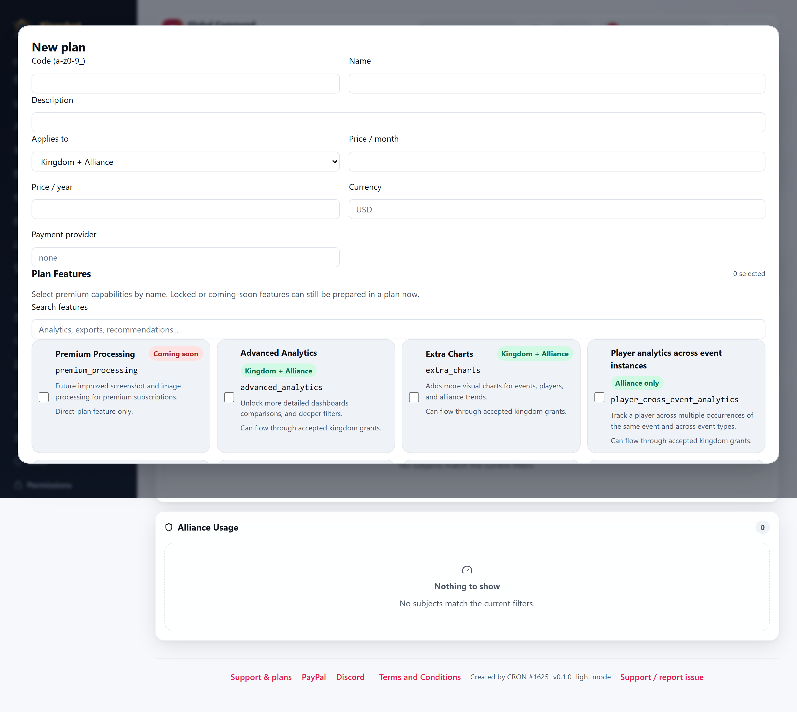

# Create & Edit Plans

This guide is for `Supreme Admin` users only.

The plan editor controls what each subscription tier includes: scope, limits, features, and the pricing information shown in the app.

## Important: the app does not process payments

The plan editor includes fields such as:

- **Price / month**
- **Price / year**
- **Currency**
- **Payment provider**

These are **display fields only**.

There is **no automated payment processing** inside the tracker. No checkout, no billing integration, and no automatic charging happens here. Payment is still handled manually through the request thread and support links. See [Payment Instructions & Completing a Request](../subscriptions/payment-instructions.md).

## What you can edit in a plan

The plan editor lets you set:

- code
- name
- description
- whether the plan applies to kingdoms, alliances, or both
- premium features
- default and active flags
- display pricing fields
- per-resource limits

## Applicability warnings

The editor validates whether your chosen features make sense for the plan scope.

For example:

- an alliance-only feature should not be attached to a kingdom-only plan without a reason
- a kingdom-focused feature may not make sense on an alliance-only plan

When you select an incompatible combination, the editor shows a warning. Treat that warning as real guidance, not decoration.

## Features and coming-soon items

The feature picker shows both currently active features and coming-soon features. That means you can prepare a plan shape now even if some features are not live yet.

For feature meanings, see [Premium Features](../subscriptions/premium-features.md).

## Resource limits

Every plan also carries resource limits.

A few things to remember:

- `0` means unlimited
- limits are per resource type
- some limits are what trigger warnings, cleanup pressure, and suspension behavior later

For the user-side view of those limits, see [Subscriptions & Quotas Explained](../subscriptions/overview.md).

## Good practice

- Keep plan codes stable and simple.
- Use clear names so admins and requesters can tell plans apart.
- Double-check applicability before saving.
- Treat pricing as communication only, not billing logic.
