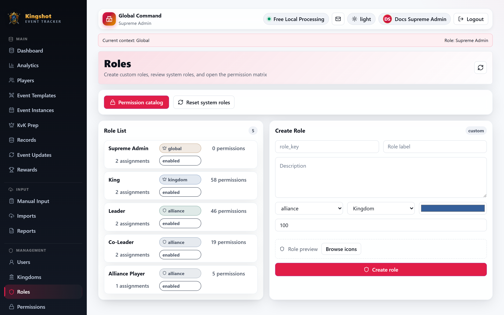
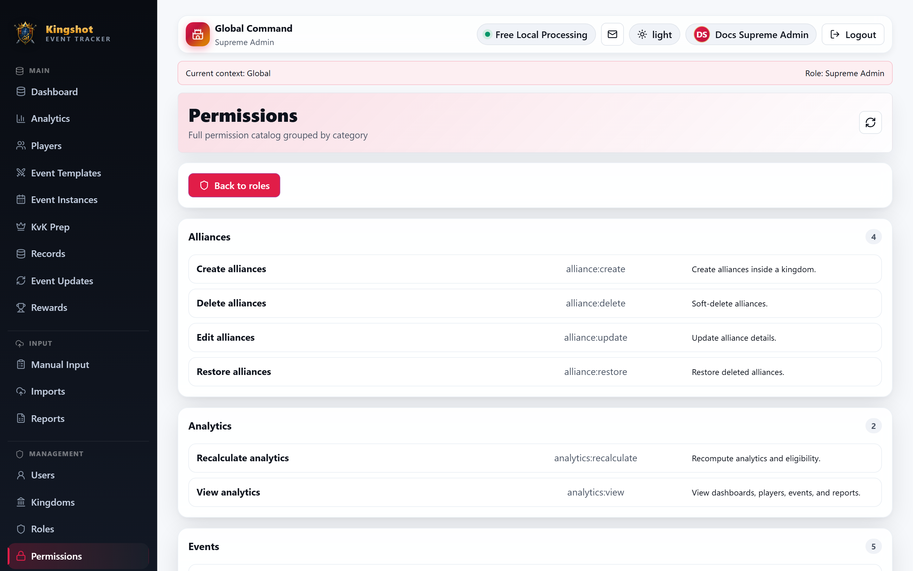

# Create & Edit Custom Roles

This guide is for `Supreme Admin` users only.

The **Roles** area is where you review the five built-in system roles, create new custom roles, clone an existing role, and edit a role's permission matrix.

## What this area is for

Use the Roles area when you need to:

- review the built-in roles
- create a custom role
- clone an existing role as a starting point
- change a role's permission matrix
- reset system roles back to their defaults
- delete a custom role that is no longer needed

## System roles vs custom roles

The app includes built-in system roles:

- `Supreme Admin` (Platform-wide global access)
- `Moderator` (Scoped content & user moderation privileges)
- `King` (Kingdom-scoped administration)
- `Alliance Leader` & `Co-Leader` (Alliance management)
- `Alliance Player` (Standard player access)

## AttributeBadge Component & UI Display

Roles are displayed across user management tables, profiles, and administrative headers using the visual **AttributeBadge Component**. 

Attribute badges dynamically render role badges with distinct color themes, scope indicators (`Global`, `Kingdom`, `Alliance`), and priority flags for clear visual identification.

## Automatic Session Revocation

When a user's role permissions, assigned roles, or credentials are modified:

- **Immediate Session Invalidation**: Active sessions for the affected user are automatically revoked across all devices and active browsers.
- **Re-Authentication Prompt**: The affected user is prompted to sign in again to receive their updated access token and refreshed permission context.
- **Tenant Scope Protection**: Kingdom and alliance administrators are strictly prevented from assigning roles outside their authorized tenant boundary.

Important rules:

- system roles cannot be deleted
- system role keys cannot be changed
- resetting system roles restores their default permission set
- custom roles can use any combination of permissions from the catalog

If you want the full list of permission keys and what each one means, use [Permission Reference](../reference/permission-catalog.md).

## Open the roles area

1. Open **Admin**.
2. Select **Roles**.

The page has two main parts:

- a **Role List**
- a **Create Role** form

## Review the role list

Each role row shows:

- the role label
- the scope type
- how many permissions it currently has
- how many user assignments use it
- whether it is enabled

Select a row to open the role detail page.

## Create a custom role

From the **Create Role** form, enter:

- a unique role key
- a label
- an optional description
- a scope type: `global`, `kingdom`, or `alliance`
- an icon
- a color
- a priority

Then select **Create role**.

This only creates the role record. After that, open the role detail page and choose its permissions.

## Edit a role

On the role detail page, you can edit:

- label
- description
- scope type
- icon
- color
- priority
- enabled status
- permission checkboxes

For system roles, the key is locked. For custom roles, the key can be edited.

## Edit the permission matrix

The right side of the role detail page groups permissions by category. Check or clear the permissions you want, then save the role.

Use [Permission Reference](../reference/permission-catalog.md) while doing this so you know what each key allows.

## Clone a role

Use the **Clone Role** section on the detail page when you want a copy with:

- the same scope type
- the same icon and color
- the same current permission set

You only need to provide:

- a new role key
- a new label

This is the fastest way to make a variation of an existing role.

## Reset system roles

Use **Reset system roles** when the built-in roles need to return to their default baseline.

This is useful if someone experimented with system-role permissions and you want to restore the shipped defaults.

## Delete a custom role

Only custom roles can be deleted.

Before deleting one:

- make sure it is no longer assigned to any users
- make sure you do not still need it as a template for another custom role

If a custom role is still assigned, the app blocks deletion until those assignments are removed or changed first.

## Scope still matters after creation

Custom roles follow the same scoped-assignment model as built-in roles:

- `global`
- `kingdom`
- `alliance`

Creating a role does not assign it to anyone yet. After the role exists, use [Assign or Remove Roles](../how-to/assign-roles.md) to place it on a user in the correct kingdom or alliance context.
