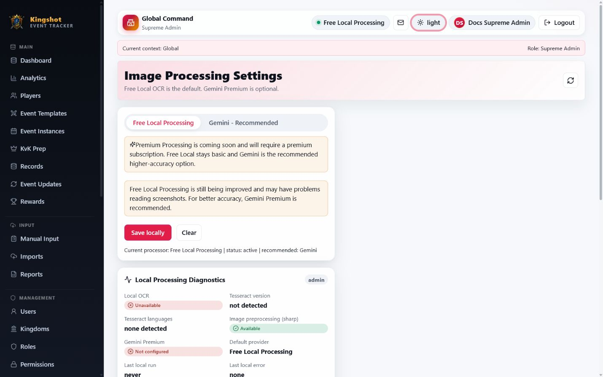

# Administer OCR Providers

The **Image Processing Settings** area controls which screenshot-processing options users can see and use.

## What this admin-facing area includes

The current interface really does include:

- provider enable or disable controls
- a recommended-provider setting
- a warning-message setting for Free Local Processing
- diagnostics for local OCR and Gemini status
- a local OCR test action

This admin-facing control surface appears to be recently added compared with older planning notes, but it is present in the current interface.

## Provider controls

Authorized admins can manage:

- **Enable Free Local Processing**
- **Enable Gemini**
- **Suspend system OpenRouter key**
- **Enable Premium Processing placeholder**
- the recommended provider users see first

Premium Processing is still only a placeholder today.

## System Free AI control

The system OpenRouter key is configured on the server and is used by default. It is never returned to browsers.

When **Suspend system OpenRouter key** is enabled:

- the Free AI provider remains visible
- the server stops using the system key immediately for new requests
- users see instructions in Image Processing Settings to create and save their own OpenRouter key
- an absent personal key blocks the request with a clear configuration message

Disabling suspension restores system-key use. Existing imports are unaffected.

## Warning text

Admins can also control whether a warning appears on imports when users choose Free Local Processing, and they can edit the text of that warning.

## Diagnostics panel

The diagnostics panel can show things like:

- whether local OCR is available
- Tesseract version and language support
- image preprocessing availability
- whether Gemini is configured
- default provider
- the last run or last error

It also includes a **Test Local OCR** action.

## Good practice

- leave Free Local enabled unless you have a strong reason not to
- recommend Gemini when users regularly handle difficult screenshots
- do not describe Premium Processing as live yet

## Related

- [Choose an Image-Processing Provider](../imports/choose-provider.md)
- [Set Up Your Gemini API Key](../imports/gemini-key.md)
- [Set Up Free AI Extraction](../imports/openrouter-free-ai.md)
