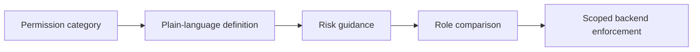

# Permissions

> **Admin-only.** Permissions are enforced by the backend; this page makes them understandable and reviewable.

The Permissions page groups privileges by category, adds plain-language descriptions and risk guidance, and supports searching and comparing roles. Technical permission codes remain available as references, but they are not the primary interface.

## How to use it

1. Search for an action, such as `restore`, `import`, `users`, or `subscription`.
2. Filter by category to reduce the permission matrix.
3. Read the description and risk label before assigning a role or custom permission.
4. Compare roles when deciding whether a role should receive a capability.

## Risk guidance

| Risk | Meaning |
|---|---|
| Normal | Routine scoped work such as viewing or updating ordinary records. |
| Sensitive | Affects users, imports, subscriptions, settings, logs, or a wider scope. |
| Dangerous | Can delete, purge, restore, alter global/security state, or materially change platform data. |

Only grant the smallest permission set needed. The client may hide unavailable controls, but the server remains responsible for enforcement.

## Visual model

## Related

- [Permission Catalog](/reference/permission-catalog)
- [Manage Roles](/admin/manage-roles)
- [Role Protection Rules](/roles/protection-rules)
