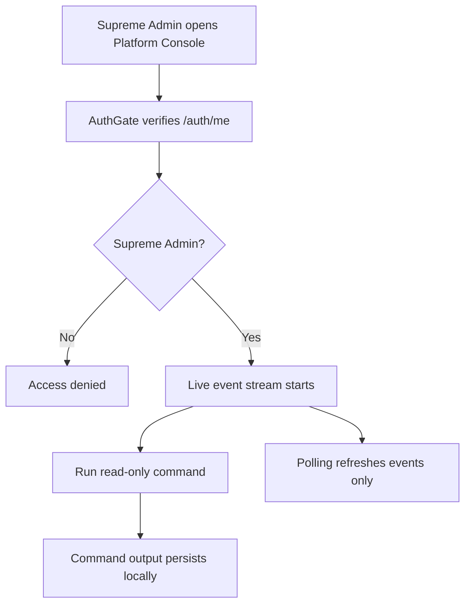
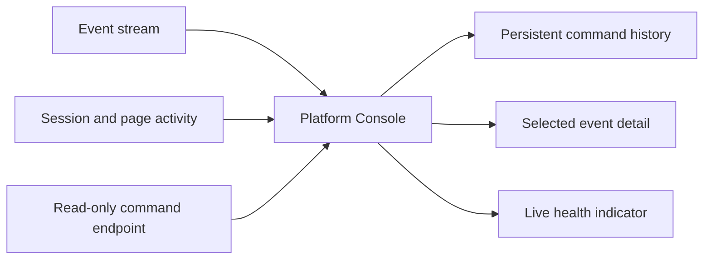

# Platform Console

> Supreme Admin only. Standalone app at `platform-console/`.

Platform Console is the external/global operations terminal for the platform. It is not the same page as Processing Console.

## What it shows

- live platform audit/activity stream;
- login and session activity;
- current page/activity tracking;
- processor/import/subscription summaries;
- read-only command output.

Commands remain read-only. They must not expose API keys, tokens, passwords, or secret env values.

## Responsive behavior

On mobile:

- terminal header stacks cleanly;
- status tiles use two columns;
- event rows become readable cards;
- command input remains touch-friendly;
- command output/history persists across polling and refresh.

On tablet:

- the terminal keeps the hacker/ops layout with larger event and command panes.

## Command flow

## Available commands

`help`, `status`, `whoami`, `sessions`, `logins`, `activity`, `users online`, `processors`, `imports`, `subscriptions`, `analytics`, `events`, `clear`.

`clear` clears only local terminal output. It does not delete audit logs.

## Visual model

The event stream refreshes independently from the command pane. A refresh adds new events without clearing command output, typed input, filters, selected detail, or local command history.
