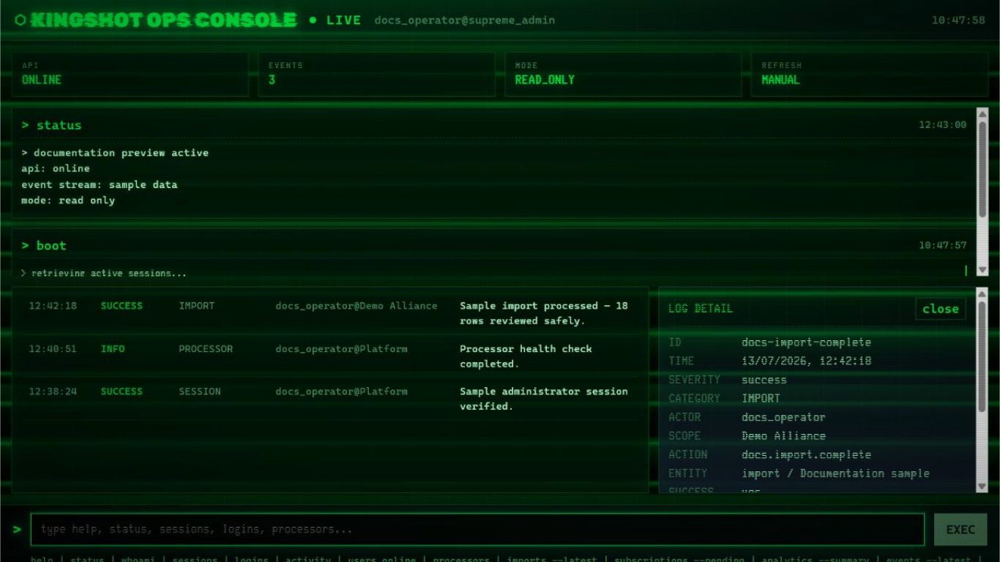

# Platform Console

> Supreme Admin only. Standalone app at `platform-console/`.

Platform Console is the external/global operations terminal for the platform. It is not the same page as Processing Console.

The image above is rendered with fixed sample activity. It demonstrates the complete layout without publishing real accounts, timestamps, actions, or operational history.

## What it shows

- live platform audit/activity stream;
- login and session activity;
- current page/activity tracking;
- processor/import/subscription summaries;
- read-only command output.

## Observability Sections

The Platform Console includes specialized monitoring sections:

| Section | Description | Key Indicators Tracked |
| --- | --- | --- |
| **System Configuration** | Global settings, environment variables, base path support | Active base path (`/games/kingshot/`), feature toggles, environment state |
| **Providers** | External AI & OCR service integration health | Gemini/OpenAI key status, Henod worker status, error rates |
| **Audit Log** | Immutable administrative activity stream | User actions, role changes, configuration edits, timestamps |
| **Security Events** | Real-time security telemetry & session state | Failed authentication, CSRF exemptions, instant session revocations |
| **Subscriptions & Usage** | Real-time plan usage & quota tracking | Active kingdom/alliance grants, quota warnings, plan suspensions |
| **Bear Data & ML** | Machine Learning model performance monitoring | Inference latency, prediction variance, dataset drift for `/bear-ml/predict` |
| **Platform Analytics** | First-party traffic, engagement, feature, conversion, live-presence, and reliability reporting | Period comparison, active users, routes, features, 4xx/5xx rates, p50/p95 latency |
| **Platform Updates** | Audited release drafting, publication, scheduling, and announcement management | Status, revision, audience, impressions, dismissals, clicks |
| **Legal & Privacy** | Policy publication readiness and code-backed inventories | Documents, technologies, processors, retention, unresolved facts |

Commands remain read-only. They must not expose API keys, tokens, passwords, or secret env values.

## Responsive behavior

On mobile:

- terminal header stacks cleanly;
- status tiles use two columns;
- event rows become readable cards;
- command input remains touch-friendly;
- command output/history persists across polling and refresh.

On tablet:

- the terminal keeps the hacker/ops layout with larger event and command panes.

## Command flow

Only Supreme Admins can open the console. Its live activity view and command area are read-only.

## Available commands

`help`, `status`, `whoami`, `sessions`, `logins`, `activity`, `users online`, `processors`, `imports`, `subscriptions`, `analytics`, `events`, `clear`.

`clear` clears only local terminal output. It does not delete audit logs.

The event stream refreshes independently from the command pane. A refresh adds new events without clearing command output, typed input, filters, selected detail, or local command history.

See [Platform Updates and Analytics](platform-updates-and-analytics.md) for publication states, announcement targeting, metric semantics, and privacy safeguards. See [Legal, Consent, and Data Rights Administration](legal-consent-and-data-rights.md) for legal readiness.
