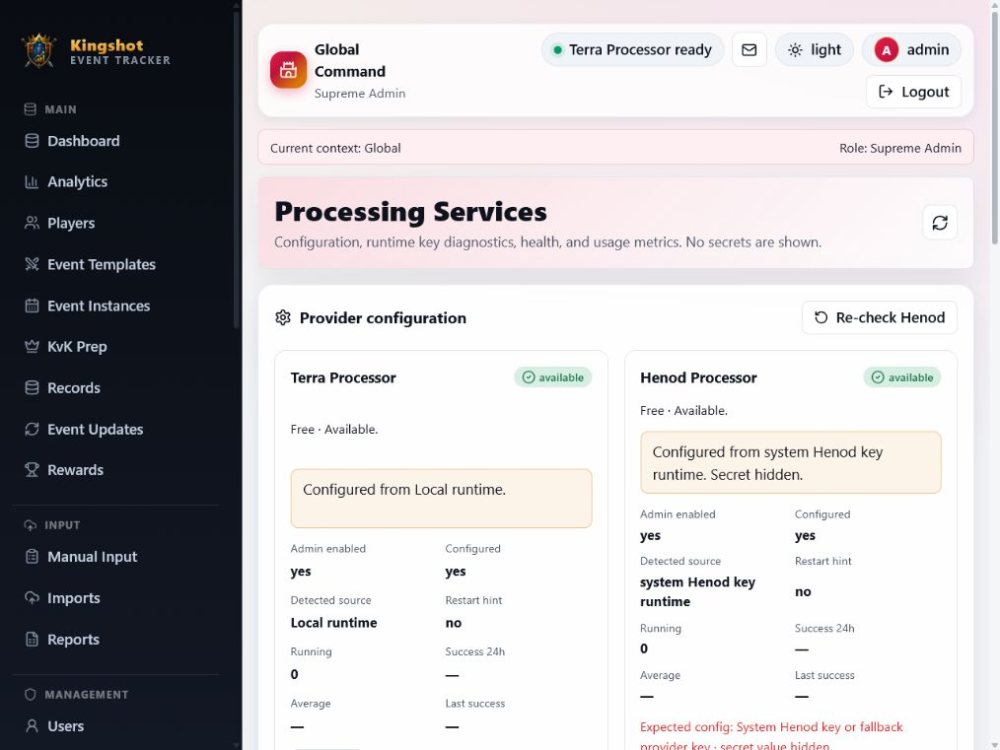

# Processing Services

> Supreme Admin only.

Processing Services is the configuration and health dashboard for image-processing providers. It is separate from Processing Console.

## Purpose

Use this page for:

- provider health;
- admin enable/disable toggles;
- safe service readiness status;
- user-safe diagnostics;
- queue and usage metrics;
- last success/error information;
- Henod re-check action.

## What changed in the responsive pass

- Status cards stack on mobile and tablet.
- Long status messages wrap safely instead of overflowing.
- Normal users never see sensitive service details.
- Supreme Admins see safe readiness, health, and recent-error information.

## Provider diagnostics

| Field | Meaning |
|---|---|
| Admin enabled | Whether the platform toggle allows this provider. |
| Ready | Whether the service can currently accept work. |
| Availability reason | A safe explanation for an unavailable service. |
| Recovery guidance | Whether an administrator should re-check the service or schedule maintenance. |
| Metrics | Running jobs, success rate, duration, last success/error. |

## Processing Services vs consoles

## Operating boundary

Processing Services is deliberately not a live console. It is the status/configuration destination: provider health, enablement, safe diagnostics, re-check actions, and metrics. See [Processing Console](../imports/processing-console.md) for processing jobs and [Platform Console](platform-console.md) for global activity.
