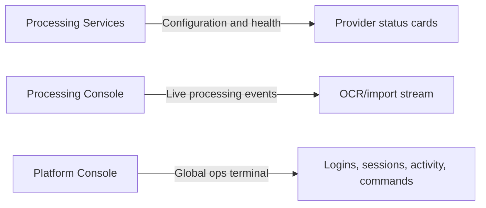

# Processing Services

> Supreme Admin only.

Processing Services is the configuration and health dashboard for image-processing providers. It is separate from Processing Console.

## Purpose

Use this page for:

- provider health;
- admin enable/disable toggles;
- runtime key/config status;
- sanitized diagnostics;
- queue and usage metrics;
- last success/error information;
- Henod re-check action.

## What changed in the responsive pass

- Status cards stack on mobile and tablet.
- Long env/config diagnostics wrap safely instead of overflowing.
- Normal users never see secret/env details.
- Supreme Admins see expected env names, detected source, restart hint, and sanitized last errors.

## Provider diagnostics

| Field | Meaning |
|---|---|
| Admin enabled | Whether the platform toggle allows this provider. |
| Configured | Whether runtime config is visible to the backend. |
| Detected source | Sanitized source such as `HENOD_API_KEY:process_env`; secret values are hidden. |
| Restart hint | Whether a backend restart may be needed after env changes. |
| Metrics | Running jobs, success rate, duration, last success/error. |

## Processing Services vs consoles

## Operating boundary

Processing Services is deliberately not a live console. It is the status/configuration destination: provider health, enablement, safe diagnostics, re-check actions, and metrics. See [Processing Console](../imports/processing-console.md) for processing jobs and [Platform Console](platform-console.md) for global activity.
