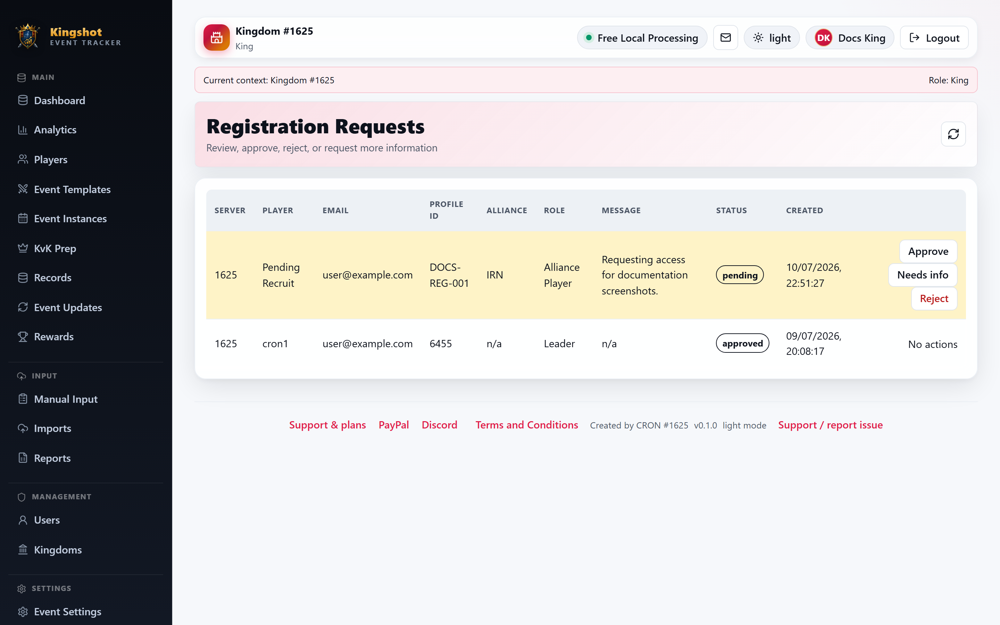

# Registration Settings

This guide is mainly for `Supreme Admin` users. Some setups may also let a `King` manage this page.

Registration Settings control how public account requests are presented and what information the request form requires.

## What you can configure

The page includes:

- page title
- instructions
- contact information
- an **Enable registration requests** switch
- a **Require profile ID** switch
- a **Require alliance tag** switch
- allowed requested roles, including Moderator where enabled
- a message shown while a requested role is under review

Registration can also activate a safe Alliance Player account while the requested role is reviewed. This is separate from full registration approval.

## What this page affects

These settings shape the public registration experience described in [Request an Account](../getting-started/registering.md), and they support the admin-side queue described in [Approve Registration Requests](../how-to/approve-registrations.md).

## Good practice

- disable registration requests if you want account creation to stay fully manual
- keep the instructions specific to your kingdom or platform process
- require profile ID or alliance tag only when your onboarding process really needs them
- explain that a requested role can remain pending after the account becomes active
- review profile-ID conflicts from the Player Link Reviews page
