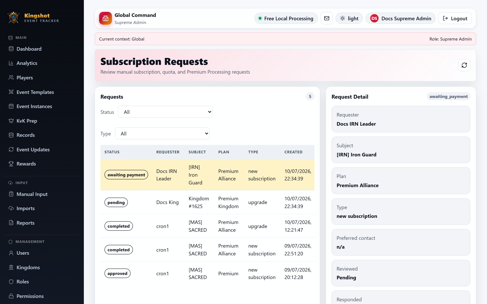
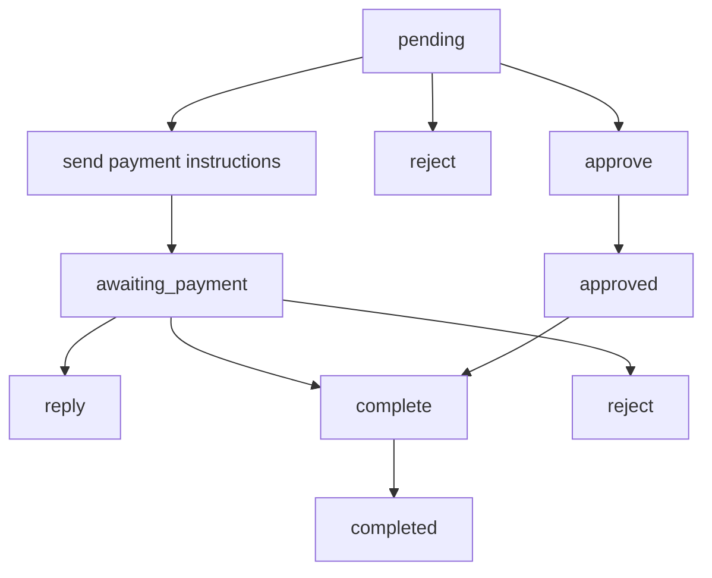

# Handle Subscription Requests

This guide is for `Supreme Admin` users only.

The **Subscription Requests** page is the admin-side queue for manual subscription, upgrade, quota, and premium-interest requests.

## What you can do here

From this queue, you can:

- filter by status
- filter by request type
- open request details
- add an admin note
- send payment instructions
- send a reply
- approve, reject, or complete the request
- optionally assign a plan when completing

## Admin-side request flow

This is the core state machine for the admin side:

This complements the requester-side explanation in [Payment Instructions & Completing a Request](../subscriptions/payment-instructions.md).

## What the detail panel includes

The request detail view can show:

- requester
- subject
- requested plan
- request type
- preferred contact
- requester message
- requested quota or metadata
- payment instructions
- conversation history
- admin note

It also lets you choose an optional plan to assign when the request is completed.

## Good practice

- Use **reply** for clarifications without changing the request state.
- Use **payment instructions** when the next step is manual payment outside the app.
- Use **complete** only when the subscription change is truly ready to take effect.
- Use **assign plan on completion** carefully so the final state matches what was agreed.
