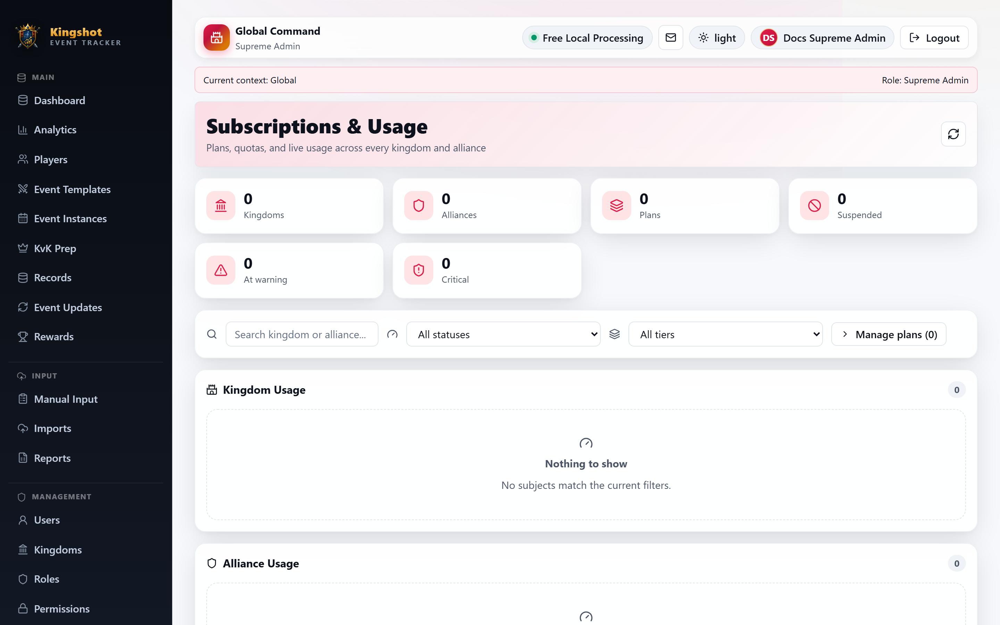

# Suspend & Unsuspend

This guide is for `Supreme Admin` users only.

This page explains the **admin action** of suspending or unsuspending a kingdom or alliance from the subscriptions dashboard. For what suspension feels like to users, and how cascade behavior works, see [Suspension & Limited Mode](../subscriptions/suspension.md).

## Where you do this

Open [Subscriptions & Usage Manager](subscriptions-dashboard.md), find the kingdom or alliance row, and use:

- **Suspend** to pause writes
- **Unsuspend** to restore normal write access

## What the current modal asks for

In the current UI, the suspend action asks for an optional **message shown to affected users**.

That message is useful for notes like:

- suspended pending payment
- temporary admin hold
- contact support before continuing

## What suspension does

Suspension blocks normal write actions for that subject while keeping read access available. The detailed user-facing effects, cascade behavior, and the special survival rule for directly subscribed alliances are already explained in [Suspension & Limited Mode](../subscriptions/suspension.md).

## About reasons and overrides

The backend tracks suspension reasons, and the broader suspension model includes override behavior in some cases, but those details are best understood from the platform suspension rules rather than from this action guide alone.

Use [Suspension & Limited Mode](../subscriptions/suspension.md) as the source of truth for:

- cascade rules
- usage-limit versus harder admin reasons
- when an alliance can survive a parent suspension

## Good practice

- Open the usage detail before suspending so you understand the current state.
- Add a user-facing message when the pause needs explanation.
- Unsuspend only after the underlying issue is actually resolved.
