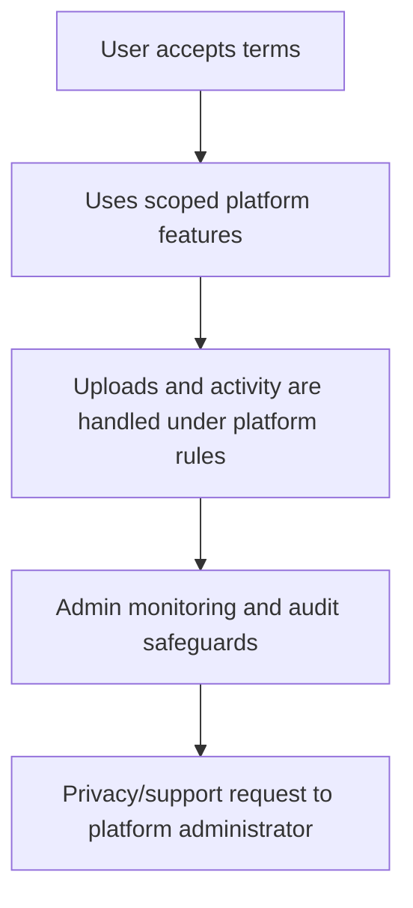

# Terms, Privacy & Platform Rules

> This guide explains the platform policy areas reflected in the current Terms & Conditions. It is practical product documentation, not legal advice. A qualified legal professional should review the policy before public production use.

## What the terms cover

- Account usage, roles, permissions, and scope boundaries.
- User-provided screenshots, spreadsheets, OCR/image processing, and review responsibility.
- Optional bring-your-own Gemini/OpenAI keys: keys are used only for the requested feature and must not be shared between users.
- Premium availability, manual payment/support arrangements, suspension, maintenance, and refund/cancellation terms that the operator should configure for its deployment.
- Analytics and recommendations as decision support, not guaranteed outcomes.
- Supreme-Admin operational monitoring: login/session/page/activity context is used for platform security and support, never to expose secrets in the console.
- Cookie/session handling, retention, and practical privacy requests.
- Acceptable use: no doctored screenshot submissions, permission bypasses, secret sharing, platform abuse, cheating, or gameplay/account automation.
- Independent-platform notice: the platform is not officially affiliated with Kingshot.

## Privacy requests

Where applicable, users can ask the platform administrator for access, correction, export, restriction, or deletion of their personal data. The operational response depends on the deployment, retained records, legal obligations, and scope of the request. The product is designed to support GDPR-style and US/California-style privacy expectations without claiming a specific legal determination.

## Screenshots and imports

Uploads are private platform assets. They are available only through authenticated, scope-checked access and should contain only information needed for event tracking. Do not submit content you do not have a right to share.

## Monitoring and retention

The platform may retain audit/activity records needed for security, support, account administration, and scoped operations. Console output is read-only and is designed not to reveal passwords, API keys, tokens, or raw environment values.

## Policy flow

Open **Terms & Conditions** from the sign-in/registration flow or platform footer for the current in-product text.
