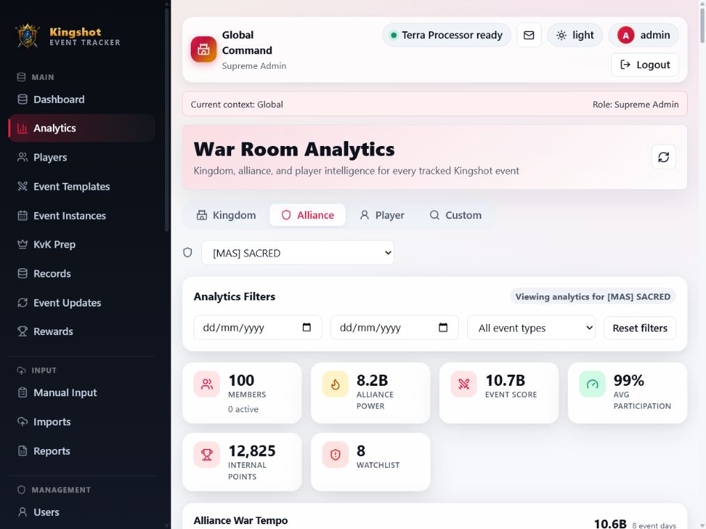
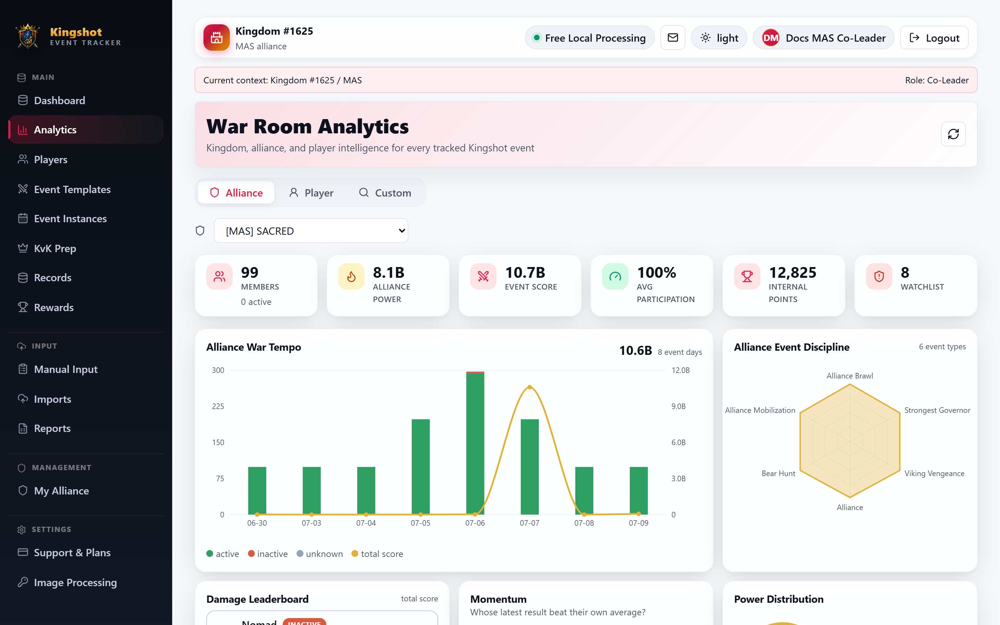

# Alliance Analytics

The **Alliance** tab is the main analytics view for day-to-day leadership work. It shows how one alliance is performing across tracked events and which players may need attention.

If this is your first premium analytics page, see [Premium Features](../subscriptions/premium-features.md) for the locked/active pattern used by premium-only parts of analytics.

## Who this is for

This page is useful for:

- `King` users reviewing one alliance inside their kingdom
- `Alliance Leader` and `Co-Leader` users managing their own alliance
- alliance-scoped readers who are allowed to view analytics

## What you will see

The Alliance tab usually includes:

- summary cards for members, alliance power, event score, participation, internal points, and watchlist size
- trend charts for alliance tempo and event discipline
- a damage leaderboard
- momentum panels showing who is rising and who is slipping compared with their own recent pattern
- a member table with score, average, participation, missed events, and status

Selecting a player opens that player's deeper analytics view when your premium player feature is active.

## Alliance recommendations slot

This tab also contains the place where alliance follow-up recommendations appear.

When the relevant premium recommendation feature is active, the page can show:

- an inactivity watchlist
- follow-up suggestions for players with low participation or inactive patterns

When that feature is not active, the page shows a notice instead of those recommendation details. For the full recommendation picture, including cleanup suggestions outside analytics, see [Smart Recommendations](recommendations.md).

## What this tab is best for

Use Alliance analytics when you want to:

- review your strongest and weakest performers
- check if participation is slipping
- compare event categories
- decide which players need follow-up before rewards or reminders

## Related guides

- [Analytics Overview](overview.md)
- [Player Cross-Event Analytics](player-cross-event.md)
- [Smart Recommendations](recommendations.md)
- [Review Reward Eligibility](../how-to/rewards.md)
