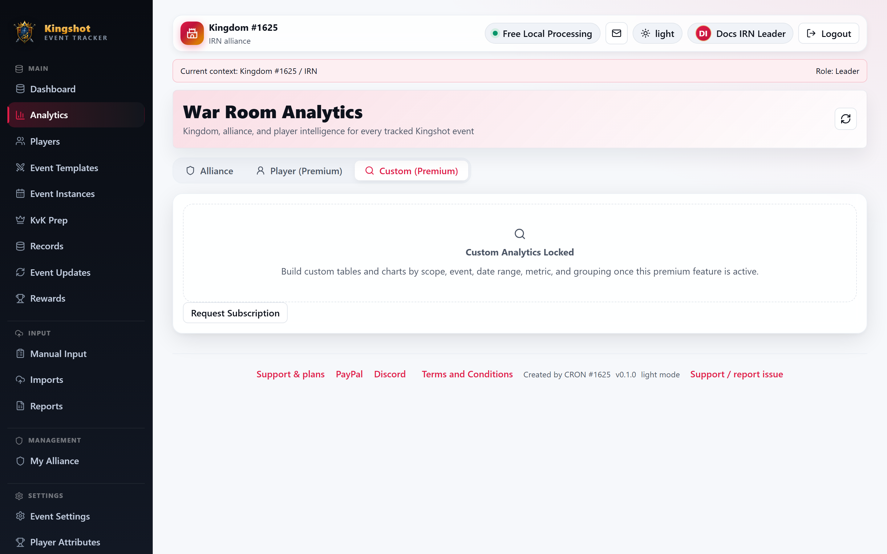
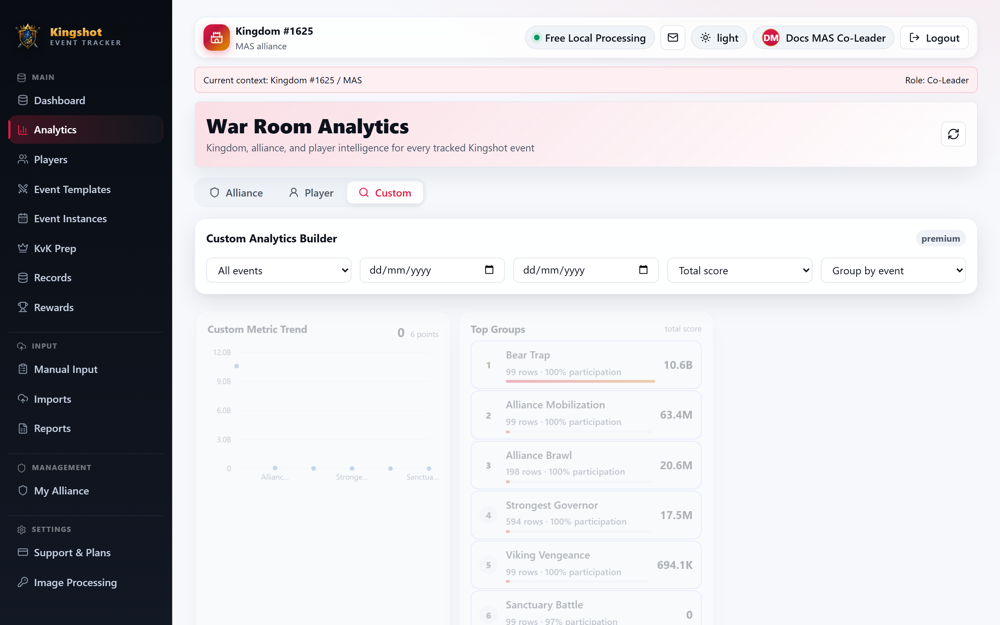

# Custom Analytics Builder

The **Custom** tab is a premium builder for making your own analytics view from the data already inside your scope.

For the general locked/active premium behavior, see [Premium Features](../subscriptions/premium-features.md). This page focuses on the Custom tab itself.

## Locked state

Without the custom analytics premium feature, the tab shows a locked card and a subscription request button instead of data.

The locked message says this feature can build custom tables and charts by:

- event
- date range
- metric
- grouping

## Active state

The unlocked builder is present in the current frontend code and is working as a real builder, not just a placeholder.

When active, the page shows:

- an **All events** filter
- **from** and **to** date filters
- a metric selector with **Total score**, **Average score**, **Participation rate**, **Row count**, and **Active count**
- a grouping selector with **event**, **date**, **player**, **alliance**, **category**, and **status**
- a trend chart for the selected metric
- a **Top Groups** card
- a **Custom Analytics Table**

The results table includes:

- group name
- the selected metric value
- total score
- average score
- participation
- row count
- active count

## What this tab is best for

Use Custom analytics when the built-in tabs are close, but not quite the question you need answered. For example:

- compare one metric across event types
- narrow analytics to a date range
- group results by alliance, player, or status
- look at participation instead of score totals

## Verification note

This file is based on direct frontend code verification of the unlocked builder. No fallback wording was needed for the active state.

## Related guides

- [Analytics Overview](overview.md)
- [Alliance Analytics](alliance.md)
- [Premium Features](../subscriptions/premium-features.md)
