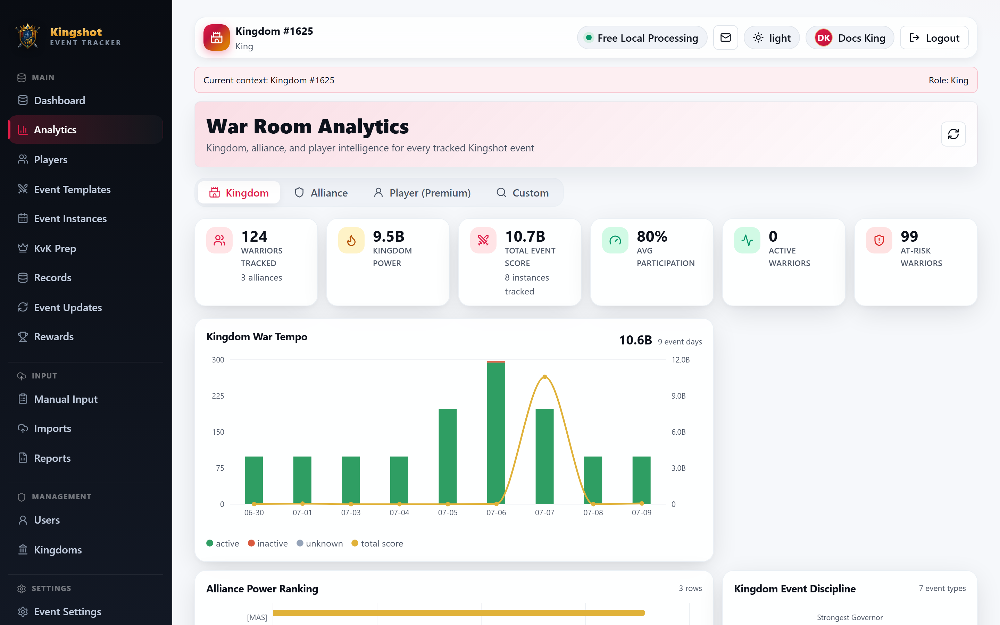

# Kingdom Analytics

The **Kingdom** tab is the highest-level analytics view in the app. It rolls up tracked players, alliances, scores, and participation across a whole kingdom.

If this is your first premium analytics page, see [Premium Features](../subscriptions/premium-features.md) for the general locked/active pattern. This page focuses on who can see the tab and what it contains.

## Who can open this tab

There are two valid paths:

- `Supreme Admin` and `King` users can open kingdom analytics as part of their normal kingdom-level scope.
- `Alliance Leader` and `Co-Leader` users can open a limited kingdom view **only** through an **accepted** premium kingdom grant that includes the `kingdom_analytics_for_granted_alliances` feature.

This is the important rule: **ordinary kingdom membership does not unlock the Kingdom tab for alliance leadership.** Being part of a kingdom is not enough by itself.

If you are using granted access, read:

- [Accept a Premium Offer](../subscriptions/accept-grant.md)
- [Kingdom Grants](../subscriptions/kingdom-grants.md)

## What granted access looks like

When the tab is coming from an accepted grant, it opens as a reduced kingdom view. You still get useful kingdom-wide comparisons and trends, but cross-alliance player detail is intentionally reduced.

That means granted access is best for:

- comparing alliances
- spotting participation trends
- seeing kingdom totals

It is not meant to expose every player-level detail across every alliance.

## What you will see

The Kingdom tab can include:

- top summary cards for tracked players, alliances, kingdom power, total score, and participation
- kingdom trend charts
- category or event-discipline summaries
- alliance standings
- top players or kingdom champions when your access level allows that detail

Selecting an alliance usually opens the Alliance tab for a closer look.

## When this tab is hidden

The tab stays hidden when:

- you are alliance-scoped and no accepted grant is active
- the accepted grant does not include the kingdom analytics sharing feature
- your role only has alliance-level access

If you expected to see it, check the alliance's effective premium source first, then confirm the accepted grant really carries the sharing feature.

## Good practice

- Use the Kingdom tab to compare alliances before drilling down.
- Treat granted kingdom analytics as a summary view, not a full kingdom admin screen.
- If you need player-level follow-up, continue into [Alliance Analytics](alliance.md) or [Player Cross-Event Analytics](player-cross-event.md).
