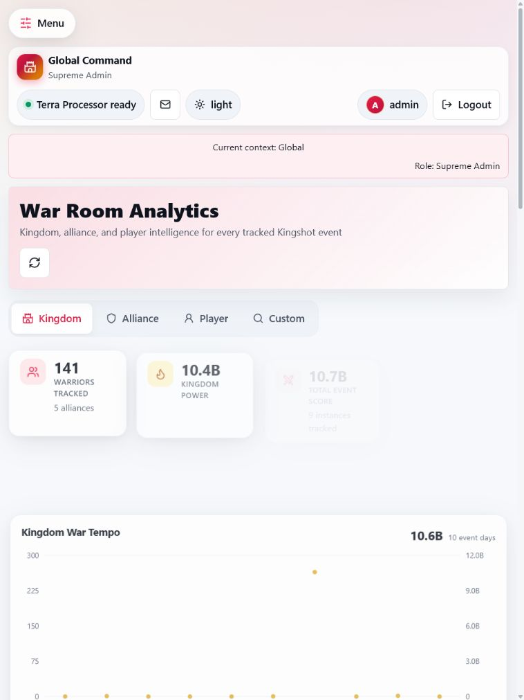
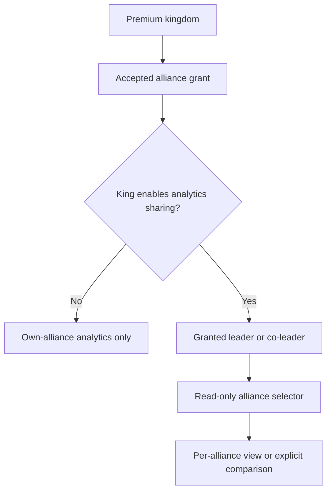

# Analytics Overview

The **Analytics** area is where the app turns saved results into trends, rankings, and follow-up views. It is meant for reading patterns across many tracked events, not for entering scores.

If this is your first premium analytics page, see [Premium Features](../subscriptions/premium-features.md) for how locked and active premium tabs behave.

## What the tabs are

The Analytics page has up to four tabs:

- **Kingdom** for kingdom-wide totals, comparisons, and trends
- **Alliance** for one alliance's members, scores, attendance, and watchlists
- **Player** for one player's history across many event instances
- **Custom** for a build-your-own chart and table view

The last two are premium tabs. On a free plan they still appear, but they show a locked card instead of data. The full locked/active pattern is explained on [Premium Features](../subscriptions/premium-features.md).

## Who can see which tab

- **Kingdom** is for `Supreme Admin` and `King` users, plus granted alliances only when an accepted premium kingdom grant includes the kingdom analytics sharing feature. See [Kingdom Analytics](kingdom.md).
- **Alliance** is the everyday analytics tab for alliance-scoped users.
- **Player** is available to alliance leadership when the premium player-across-events feature is active.
- **Custom** is available when the custom analytics premium feature is active.

## How scoping works

The page only shows data inside your current scope.

- `Supreme Admin` users can work across kingdoms.
- `King` users work inside their kingdom.
- `Alliance Leader`, `Co-Leader`, and alliance-scoped readers work inside their alliance.

If you are alliance-only, the **Kingdom** tab is hidden unless your alliance accepted a kingdom grant that specifically shares kingdom analytics. Even then, that kingdom view is still limited to the granted kingdom.

Inside the page:

- the **Alliance** tab can include an alliance picker when you are allowed to manage more than one alliance
- the **Player** tab opens from a search box or by selecting a player from another analytics tab
- the **Custom** tab applies whatever filters you choose to the data you are already allowed to see

## Mega-alliance analytics visibility

Kingdom Premium can create a view-only analytics group across accepted grants. The King enables **Allow granted alliances to view each other's analytics** from the kingdom's **Subscription & Usage** allocation area. It is disabled by default.

All of these conditions are required:

1. The kingdom has an active plan that includes the sharing feature.
2. The alliance has an active, accepted grant from that kingdom.
3. The King has enabled the setting.
4. The viewer is a leader or co-leader of a granted alliance.

This is analytics-only. A viewer can select another granted alliance or an explicit comparison, but cannot import, edit, delete, restore, reward, manage subscriptions, or manage users for that alliance. Data stays separate by alliance unless a comparison is explicitly selected.

## Recalculate analytics

Analytics recalculate automatically as results change, but some settings changes may need a manual refresh. If your role can manage analytics settings, you may see a **Recalculate analytics** button in the analytics settings area.

Use it when:

- you changed status or attribute rules
- you changed reward-related analytics inputs
- numbers look out of date after an admin change

Most day-to-day users do not need to use it.

## Where to go next

- [Kingdom Analytics](kingdom.md)
- [Alliance Analytics](alliance.md)
- [Player Cross-Event Analytics](player-cross-event.md)
- [Custom Analytics Builder](custom-analytics.md)
