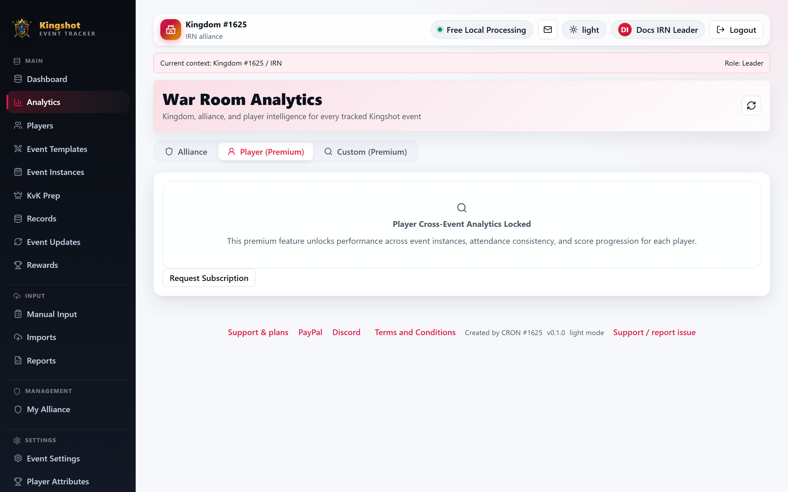
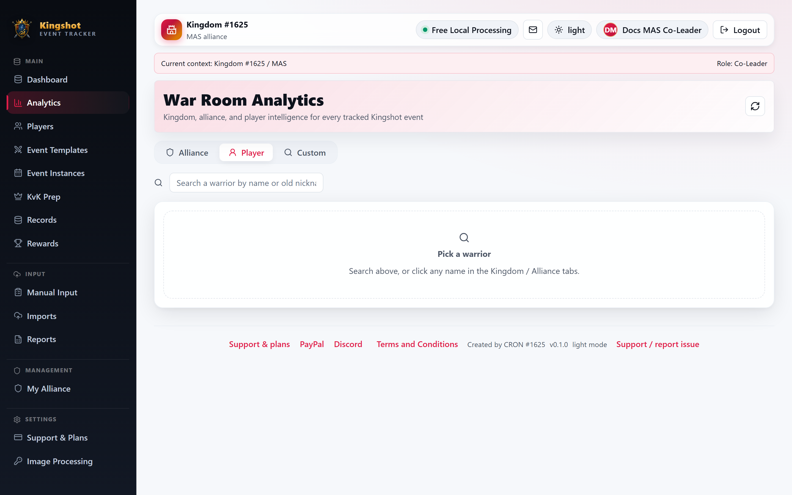

# Player Cross-Event Analytics

The **Player** tab follows one player across many tracked event instances. It is a premium view aimed at alliance leadership.

For the general locked/active premium behavior, see [Premium Features](../subscriptions/premium-features.md). This page shows what that pattern looks like specifically for the Player tab.

## Locked state

Without the premium player-across-events feature, the tab still opens but shows a locked card and a subscription request button instead of data.

The locked card explains that this feature unlocks:

- cross-event performance
- attendance consistency
- score progression over time

## Active state

When the feature is active, you can search for a player by current name or old nickname, or open a player directly from the Kingdom or Alliance analytics tabs.

The active Player tab shows:

- a player header with alliance, kingdom, power, Town Center level, and current status
- rank positions inside the alliance and kingdom
- summary cards for total score, average score, internal points, attendance, tracked events, missed events, and points rank
- charts for score history, event discipline, and attendance streak
- a **Cross-Event Consistency** section with the player's strongest events and overall consistency
- a **Performance by Event** table with attendance, totals, averages, best score, latest score, and points for each event

There is also a **Full profile** button to jump to the player's main profile page.

## What this tab is best for

Use it when you need to answer questions like:

- Is this player consistent across events?
- Are they improving or slipping?
- Which event types suit them best?
- Is their attendance strong enough for [reward eligibility](../getting-started/glossary.md#reward-eligibility)?

## Related guides

- [Alliance Analytics](alliance.md)
- [Smart Recommendations](recommendations.md)
- [Review Reward Eligibility](../how-to/rewards.md)
