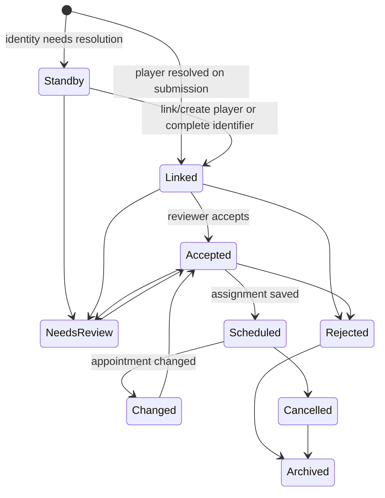

# Application statuses

Status describes the application, not a guaranteed appointment. The transition map below is the observed workflow: authorised reviewers can perform only the actions enabled for the current status.

| Status | Entry condition and visible meaning | Who changes it | Scheduling / notification |
| --- | --- | --- | --- |
| Submitted | A received application where the workflow retains this state | Submission/reviewer | Not a promise; reviewer resolves it |
| Linked | Player (and required identifier) is resolved | Submission or reviewer | Can be considered by suggestions |
| Standby | Player identity or required identifier is incomplete | Submission/reviewer | Not auto-placeable; reviewer resolves it |
| Needs review | Information, eligibility or a decision needs checking | King/Minister | Not a final appointment |
| Accepted | Approved for consideration | King/Minister | Placeable; may still remain unscheduled |
| Scheduled | An assignment exists in the schedule | Scheduling team | Check whether the schedule is published |
| Changed | Application or appointment needs attention after change | Scheduling team | Recheck the current/next published version |
| Rejected | Declined | King/Minister | Cannot be scheduled unless workflow changes it before archival |
| Cancelled | Withdrawn or stopped | Applicant/reviewer as available | No active appointment |
| Archived | Retained history | Reviewer | No active scheduling |

Editing an application while the cycle is open can require renewed review; it does not automatically preserve a previous schedule decision. Players see their own application status and published outcome; notification attempts depend on the kingdom’s configured sender, contact consent and delivery outcome.

Next: [Review applications](reviewing.md) or, for applicants, [Applying](applying.md).
