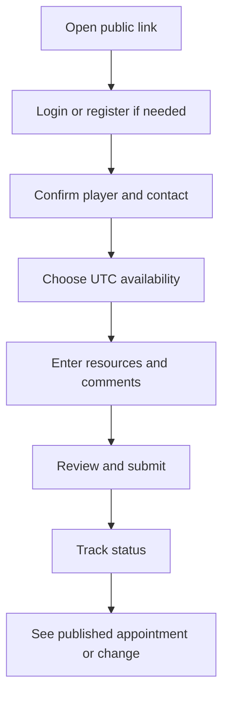

# Applying for a Castle Position

Use the public Castle Positions link supplied by your kingdom while applications are open. Choose the correct kingdom and cycle before entering information.

## Before you start

- Have your player identity and, where required, player identifier ready.
- Know your preferred times in **UTC**. UTC is not the time shown on your phone unless your phone is set to UTC.
- Gather the resources requested by your kingdom. Speedups are entered in days; True Gold is an amount.

## Applicant workflow

<figure class="castle-screenshot castle-screenshot--standard">
  
  <figcaption>The public entry screen identifies the kingdom and cycle, shows the application steps, and indicates when a published schedule already exists.</figcaption>
</figure>

<figure class="castle-screenshot castle-screenshot--standard">
  
  <figcaption>The identity step uses the existing mock player name and player number before resources and time preferences are reviewed.</figcaption>
</figure>

<figure class="castle-screenshot castle-screenshot--standard">
  
  <figcaption>The populated form keeps the account journey in a numbered stepper so applicants can distinguish identity, account, resources and time preferences.</figcaption>
</figure>

<figure class="castle-screenshot castle-screenshot--standard">
  
  <figcaption>The account step is part of the same saved mock application flow and precedes the resource fields.</figcaption>
</figure>

<figure class="castle-screenshot castle-screenshot--standard">
  
  <figcaption>The populated resource step shows the duration-based speedups and True Gold inputs used by the stage configuration.</figcaption>
</figure>

<figure class="castle-screenshot castle-screenshot--standard">
  
  <figcaption>The time-preference step shows the applicant’s actual UTC choices before the final review step.</figcaption>
</figure>

1. Open the public application link and select the applicable kingdom/cycle.
2. Choose the account option presented. **Login** verifies an existing account; **registration** collects new-account information. Login does not require registration-only details.
3. Select or confirm your player identity. Existing-account linking is verified; an unresolved identity may place the application on standby for review.
4. For each active stage, choose one or more preferred UTC times, acceptable alternatives, **any available time**, or unavailable times.
5. Enter requested resources and any comments or configured questions.
6. Review the summary and correct validation messages. The stepper takes you back to the incomplete step instead of silently submitting partial data.
7. Submit. The confirmation means the request was received; it is not a scheduled appointment.
8. Open **My Castle Positions** later to see the current status, provisional information, published appointment and history.

::: tip
Use alternatives honestly. A time marked unavailable is never used by automatic suggestions, even if it was also selected elsewhere.
:::

## Account, email and password behavior

An existing account can use its account identity. Guest contact is optional where the kingdom enables it; it is for communication, not proof of an appointment. A guest email is checked for validity and availability. Account email and Castle contact email can be different; notification delivery uses the available opted-in contact path, not a promise of delivery.

For registration, enter a password only when the form asks to create or change one. Returning to a review step should not require you to re-enter plaintext password information unnecessarily. See [Logging in](../getting-started/logging-in.md), [Registering](../getting-started/registering.md), and [Forgot password](../getting-started/forgot-password.md).

## Resource example

Mira enters 12 Construction days and allocates 3 General days to Construction: the displayed construction comparison is 15 days. She enters `4,500` True Gold separately; it is not a number of days and cannot be taken from the General pool.

## What happens next

The request may be linked immediately or placed on standby if the player identity needs review. A reviewer can accept it for consideration, request review, reject it, or later schedule it. Read [Application statuses](application-statuses.md) and [Notifications](notifications-and-email.md) next.

Want to know how requested times are compared after review? Read [Candidate Selection and Scheduling Logic](selection-algorithm.md).

## Troubleshooting

If submission fails, check the application window, required fields, selected UTC time, valid resource values, General allocation total and account choice. If you cannot resolve it, send the kingdom team the kingdom, cycle and visible validation message—never your password. See [Castle troubleshooting](troubleshooting.md).
