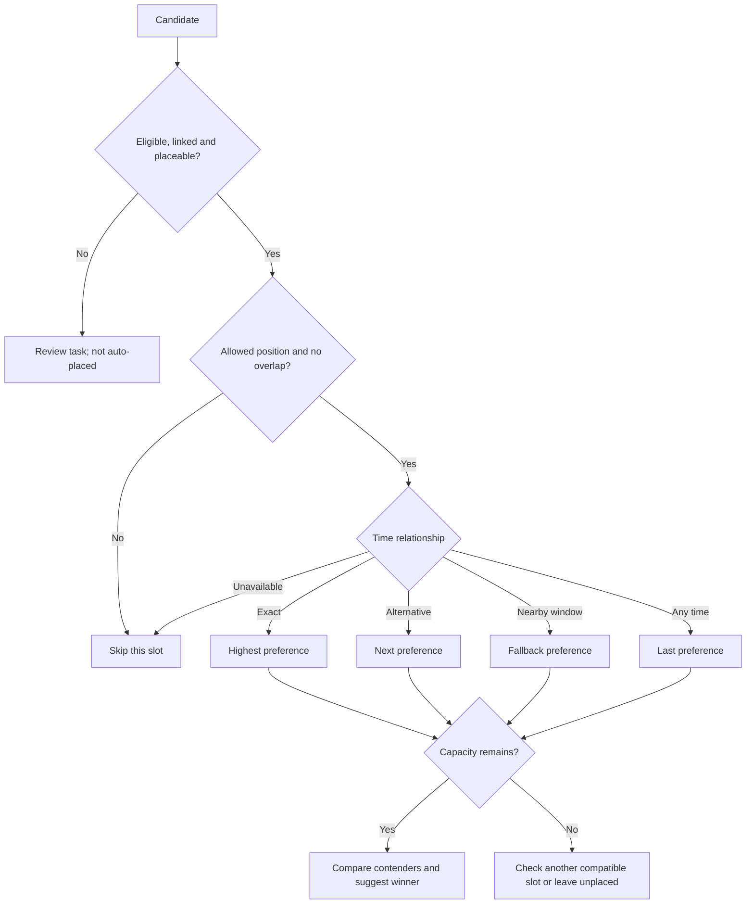

# Selection and scheduling algorithm

## Plain-language explanation

<figure class="castle-screenshot castle-screenshot--wide">
  
  <figcaption>The live planner exposes the suggestion result beside candidate cards and slot state; the screenshot is the practical interface, while the algorithm guide describes the decision logic.</figcaption>
</figure>

The planner is an **automatic suggestion engine**. It does not make final appointments or publish a schedule. For each position column it works from the earliest slot downwards and fills a slot with the best compatible candidate. A candidate who named that exact time is preferred to one who merely accepts an alternative, a nearby time, or any time. The process preserves administrator-locked assignments and prevents an applicant or player being placed twice in an overlapping appointment.

::: warning
An applicant must be eligible, linked to a player, and in a placeable status (`accepted`, `linked`, `scheduled`, or `changed`) before the automatic planner considers them. A person on **standby** or **needs review** is a review task, not an automatic contender.
:::

## Exact decision sequence

1. Load active positions and their UTC slots for the selected stage.
2. Preserve locked manual assignments first; they consume capacity and block overlapping times.
3. Keep only candidates who are eligible, linked to a player, and in a placeable status.
4. Visit each position column in its configured order and each slot from top to bottom.
5. For the current slot, exclude candidates already assigned, not allowed in that position, unavailable at that time, or overlapping another appointment.
6. Classify remaining availability: **exact preferred**, **alternative**, **within the configured nearby-time window** (60 minutes by default), or **any available time**.
7. Choose the contender using the stage’s strategy. The normal balanced strategy compares: time match, higher score, fewer named usable times, earlier submission, then application ID.
8. Fill the cell up to its configured capacity. If a preferred cell is unavailable, report the gap and continue considering later candidates and compatible cells; the live candidate-driven engine does not silently stop all later assignments merely because one preferred slot is unavailable.
9. List eligible linked candidates not placed with a reason and suggested next action. An administrator decides whether to move someone, waitlist, add a placeholder, or approve a requested-slot override.
10. The administrator reviews, edits if needed, saves the draft, finalizes and publishes separately.

## Decision table

| Condition | System response | Administrator action |
| --- | --- | --- |
| Not eligible, unlinked, or non-placeable status | Not included in the automatic contest | Resolve identity or review the application |
| Exact preferred slot is available | Eligible contender can be suggested | Confirm or adjust the draft |
| Preferred slot is full | Compare compatible contenders; consider alternatives/nearby time | Review the conflict and unplaced reasons |
| Slot is explicitly unavailable | Never suggest that slot | Choose another compatible time or keep unplaced |
| Locked/manual assignment exists | Preserve it; consume capacity | Change it manually only if policy permits |
| No compatible slot is free | Candidate remains unplaced | Waitlist, move another player, or make a manual decision |

## Selection tree

## Worked examples

- **Exact time:** Aria is eligible, linked and accepted. She selects 18:00 UTC and the first 18:00 Guard slot is open. The balanced planner suggests Aria there.
- **Full preferred slot:** Bo and Cyra request 18:00. Both are eligible. If their match is equal, the higher score wins; if scores match, the person with fewer named times wins, then earlier submission. The other may be suggested at an alternative or nearby time, or remain unplaced.
- **Incomplete resources:** Dax is linked but fails a configured minimum resource rule. Dax is excluded from automatic placement until the reviewer changes the eligibility outcome or the information is corrected.
- **Accepted but unscheduled:** Elin is accepted but has only selected a full time and no compatible fallback. Acceptance remains valid; no appointment is promised.
- **Change after publication:** A King reopens the stage, moves Fenn manually, saves and publishes a new version. Players continue to rely on the last published version until the revised one is published.
- **Standby replacement:** Gia is on standby because identity resolution is incomplete. The planner does not use Gia as an automatic replacement. After a Minister links and accepts Gia, the planner can be recalculated; the Minister still confirms the result.

## Manual overrides

Suggestions can be changed by authorized schedule administrators. Saving still rejects duplicate grid cells, duplicate applications within a stage, overlapping player appointments, invalid positions and invalid manual-player assignments. A manual assignment can therefore differ from the suggestion, but cannot bypass those structural checks. A manual move also does not publish by itself; it remains a draft change until finalization and publication.

Related: [Candidate Selection and Scheduling Logic](selection-algorithm.md), [Reviewing](reviewing.md), [Planner](schedule-planner.md), and [Publishing](publishing-and-changes.md).
