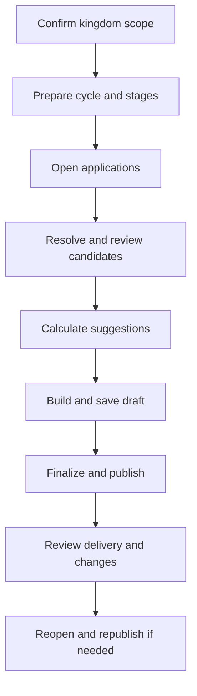

# Managing Castle Positions

This is the end-to-end Minister of Justice and King workflow.

1. Confirm your kingdom scope and access. A Minister stays within the assigned kingdom.
2. Create/open the cycle, set its title and application window.
3. Prepare stages: date, UTC timing and active positions; configure resource fields and any local eligibility/ranking rules.
4. Open applications and share the public link.
5. Review every incomplete, standby and needs-review application before relying on the planner.
6. Accept/reject candidates as appropriate. Acceptance means consideration, not an appointment.
7. Recalculate and review suggestions; resolve unplaced candidates and conflicts.
8. Build and save each stage draft. Use manual decisions only after checking overlaps, capacity and position scope.
9. Finalize, publish and inspect notification outcomes.
10. Reopen and publish a new version for changes. Escalate global settings or access issues to a Supreme Admin.

## Supreme Admin boundary

Supreme Admin work is limited here to selecting the correct kingdom, correcting access/role or platform-level email configuration, and resolving cross-kingdom issues. It is not necessary to use global access for ordinary kingdom scheduling.

Related: [Roles](roles-and-access.md), [Reviewing](reviewing.md), [Planner](schedule-planner.md), and [Publishing](publishing-and-changes.md).
