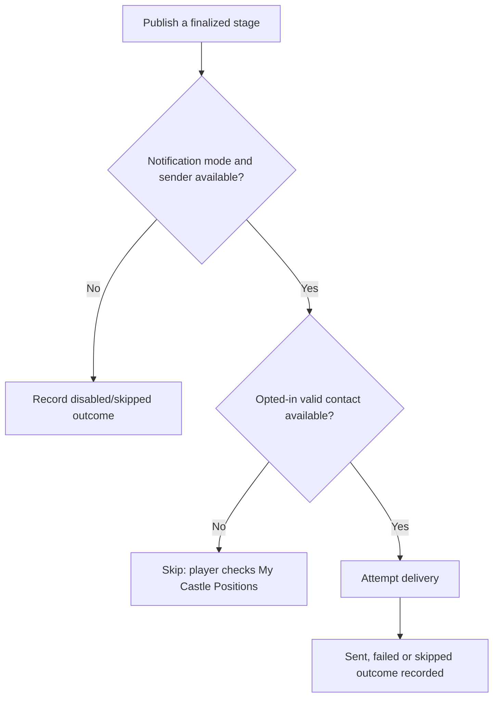

# Castle notifications and email

Castle email uses kingdom-specific sender settings. Administrators can choose automatic, manual or disabled notification mode. When a finalized stage is published in automatic mode, the system attempts to notify affected applicants with an available opted-in contact path. The log distinguishes sent, failed, skipped and disabled results; retry controls may be available for failed delivery.

## Important distinctions

- **Account email** belongs to the user account. **Contact email** can be supplied for a Castle application where the flow offers it.
- Welcome and password messages are account lifecycle messages; Castle appointment messages are separate scheduling communications.
- A missing email, opt-out, disabled sender, spam filtering or delivery failure can prevent receipt.
- Email is a convenience, not the source of truth. Players should check **My Castle Positions**, especially after a change.

No emails need to be sent for a user to apply when email is disabled or unavailable. Administrators should not send test or real notification emails merely to check a draft. See [Email settings](../admin/email-settings.md) and [Publishing](publishing-and-changes.md).
