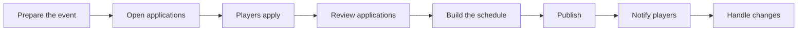

# Castle Positions

Castle Positions is the Kingdom workflow for organising KvK castle appointments. It collects player applications, records availability and resources, helps the Kingdom team build a stage-by-stage schedule, and gives players one place to see the result.

> **Not KvK Prep:** [KvK Prep](../how-to/kvk-prep.md) compares before-and-after power. Castle Positions is for applying for, assigning, and publishing castle appointments.

## Workflow

## Key words

- **Application:** a player's request to take part.
- **Candidate:** an applicant being considered for a stage.
- **Position:** a castle role or schedule column.
- **Stage:** one scheduled KvK day or part of the cycle.
- **Slot:** one position/time opening; capacity controls how many players fit.
- **Assignment:** placing a player in a slot.
- **Published schedule:** the player-visible version.

Start with [Applying](applying.md) or [Managing Castle Positions](managing.md).
