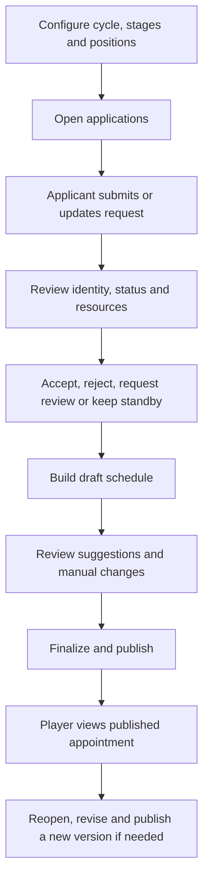

# Castle Positions

Castle Positions is a kingdom-scoped workflow for KvK castle appointments. It collects applications, availability and resources; gives the schedule team a review board and a planning preview; and shows players the published result. It is separate from [KvK Prep](../how-to/kvk-prep.md), which compares power rather than arranging appointments.

::: info
The system creates **placement suggestions**, not automatic final appointments. A King or Minister of Justice reviews the result, can change it, then saves, finalizes and publishes it.
:::

## Start here

| You are | Start with | Then |
| --- | --- | --- |
| Applicant | [Apply for a position](applying.md) | [Track your status](application-statuses.md) |
| Minister of Justice | [Management guide](managing.md) | [Review candidates](reviewing.md) and [plan a stage](schedule-planner.md) |
| King | [Roles and access](roles-and-access.md) | Follow the Minister workflow in your own kingdom |
| Supreme Admin | [Roles and access](roles-and-access.md) | Select the kingdom before making a platform-level correction |

## Lifecycle

## Concepts that prevent mistakes

- **Stage** is one scheduled event day or section of the cycle.
- **Position** is a schedule column within a stage.
- **Slot** is a position at one UTC time. Its capacity says how many appointments fit in that cell.
- **Application** is the player’s request; **assignment** is the administrator’s schedule decision.
- **Draft** and **finalized** schedules are not the published player-facing result.

Next step: applicants should read [Applying](applying.md); schedule teams should start with [Managing Castle Positions](managing.md).
