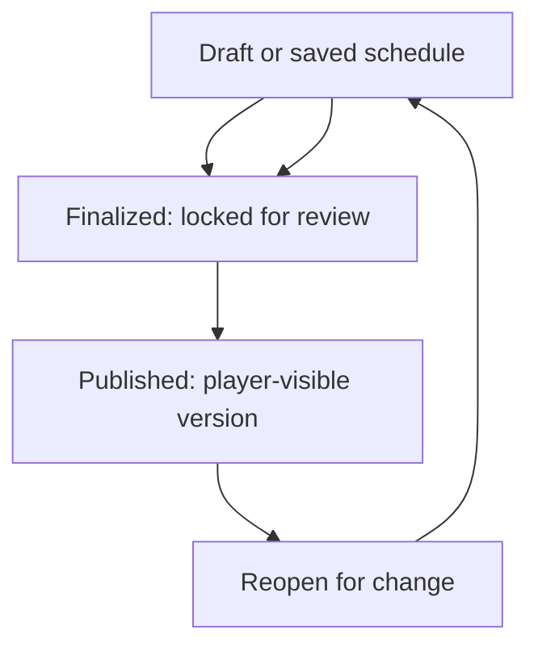

# Publishing and schedule changes

## Draft to published lifecycle

1. Save the board as a draft while scheduling is in progress.
2. Finalize after reviewing assignments, placeholders and conflicts. Finalized schedules are locked for ordinary editing.
3. Publish the finalized schedule. This creates the player-visible version.
4. For a change, reopen the stage, edit and save a new draft, finalize it and publish again.

Players continue to see the last published version while a reopened revision is being edited. Reopening does not retract an email already delivered. For urgent changes, contact affected players through the kingdom’s approved communication route as well.

## What publication does and does not do

Publication is the point at which the appointment becomes player-visible. Notification attempts may follow when notification mode, sender, opted-in contact email and delivery conditions allow them. A successful publish does not guarantee an email was received; see [Notifications and email](notifications-and-email.md).

Only a King, Minister of Justice in the correct kingdom, or Supreme Admin with selected scope can manage this lifecycle. See [Roles](roles-and-access.md).
