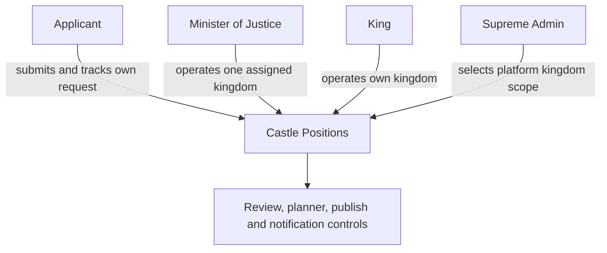

# Castle Positions roles and access

| Role | Can do | Boundary |
| --- | --- | --- |
| Applicant/player | Apply, set availability/contact choices, view own status and published appointment | Cannot see other applications or edit schedules |
| Minister of Justice | Configure cycle/stages/positions, review, schedule, finalize, publish and handle changes | Only the assigned kingdom |
| King | Same operational Castle capabilities for their kingdom | No cross-kingdom management |
| Supreme Admin | Select and manage relevant kingdom scope; correct platform-level access/settings | Use cross-kingdom access only when necessary |

An ordinary player who opens an administration route receives an access-denied response rather than a hidden form. Navigation visibility follows access, but a visible menu item is not a substitute for correct kingdom scope. For the wider role model, see [Roles overview](../roles/overview.md) and [Access denied](../getting-started/access-denied.md).

## King and Minister workflow

Both roles follow the same operational sequence: confirm scope, configure, review, calculate suggestions, build a draft, finalize, publish and handle revisions. The King provides kingdom leadership and may resolve scheduling decisions; the Minister carries out delegated justice/scheduling work. Neither role gains global platform administration merely from Castle access.
