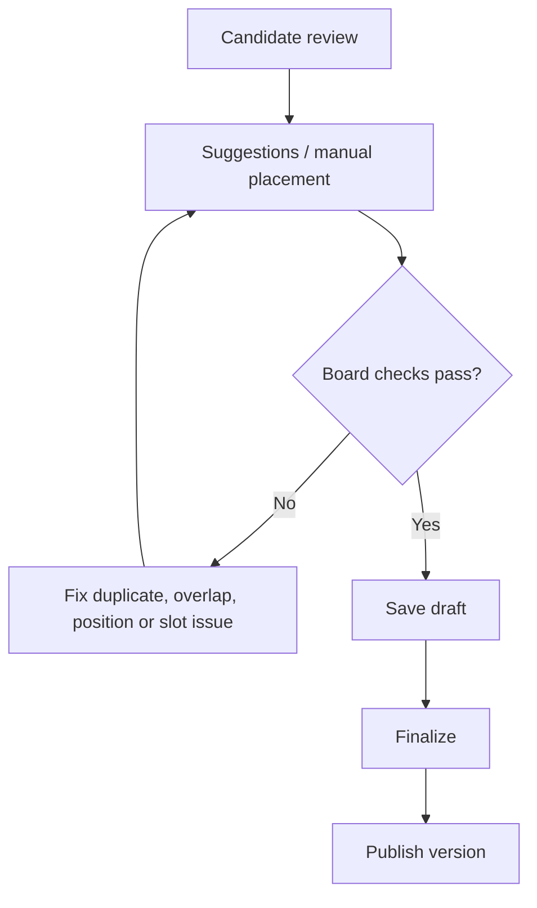

# Schedule planner

The planner is a UTC time-by-position board for one stage. A cell represents a real position/time slot; it can contain an application assignment, a manually selected eligible player, a visible reservation label, or an available placeholder.

## Minister / King procedure

<figure class="castle-screenshot castle-screenshot--wide">
  
  <figcaption>The planner combines candidate groups, suggestion status, an editable draft, slot capacity and visible assignment cards.</figcaption>
</figure>

<figure class="castle-screenshot castle-screenshot--wide">
  
  <figcaption>The lower planner view keeps the populated slot board, mock assignments, placeholders and gap guidance visible for review.</figcaption>
</figure>

1. Confirm the kingdom, cycle and stage. A stage date and active positions are required.
2. Review the candidate list: identity, status, eligibility, requested times, resource information and unplaced reasons.
3. Recalculate suggestions if configuration or applications changed. Check its state; an error or stale result is not a current recommendation.
4. Use suggestions as a draft. Drag or use controls to place candidates, or search for an active player in the same kingdom for a manual assignment.
5. Inspect conflicts and the unplaced list. Save the board.
6. Finalize only after the draft is complete, then [publish](publishing-and-changes.md).

## Checks enforced when saving

- A cell must exist in the selected active position.
- The same grid cell cannot be submitted twice.
- One application can be assigned only once in a stage.
- A manually selected player must be active and in the kingdom, and can be assigned once in that stage.
- A player cannot hold overlapping appointments, including across position columns.
- Empty cells are represented as available placeholders; reservations require a public label and cannot expose player data.
- The saved board uses a revision check. If someone changed it after you opened it, reload and reconcile rather than overwriting their work.

The placement preview itself keeps each position column gapless: it does not jump past an empty early slot to fill a later one. Administrators should review exceptions rather than treating a blank later cell as an error automatically.

Related: [Candidate Selection and Scheduling Logic](selection-algorithm.md), [Automatic placement suggestions](automatic-placement.md), [Stages and resources](stages-positions-resources.md), [Troubleshooting](troubleshooting.md).
