# Candidate Selection and Scheduling Logic

This page explains the current **suggestion** logic used by the Castle Positions planner. It is deliberately detailed so a King or Minister can understand why a candidate was suggested, displaced, or left unplaced.

::: warning
Suggestions are not appointments. The system does not save, finalise, publish, or notify a player merely because a suggestion exists. An authorised schedule administrator reviews the proposal, makes any necessary changes, saves the board, finalises it and publishes it.

## Live engine and retired engine

The live suggestion endpoint uses the current **candidate-driven competitive engine**. The older slot-driven implementation is retired and is not the live suggestion workflow. The live engine reports preference gaps for administrator attention and continues considering later candidates and compatible cells; it does not silently stop assigning every later candidate because one preferred slot is unavailable. A suggestion remains a proposal until an administrator reviews, saves, finalises and publishes it.

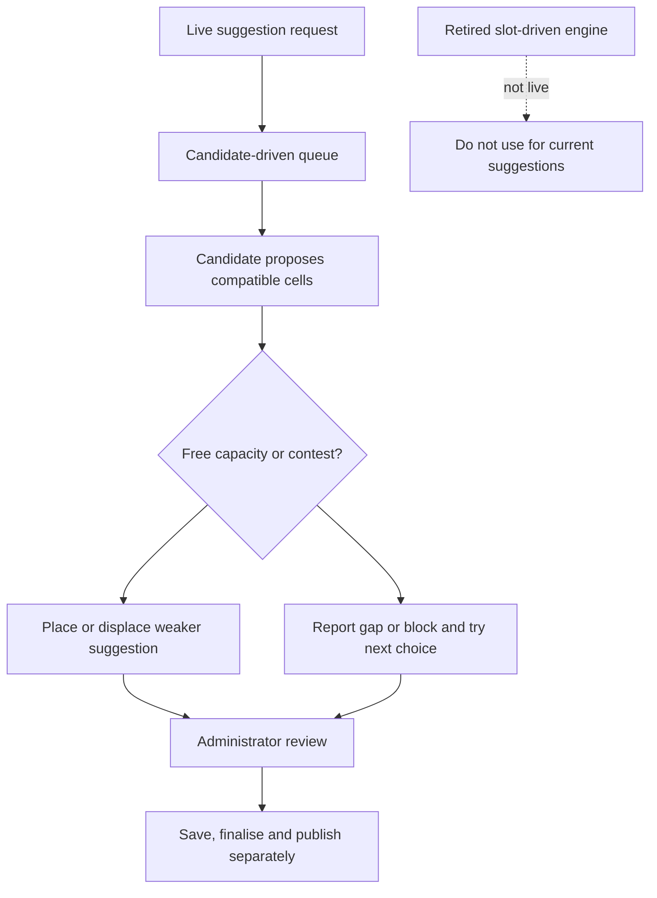

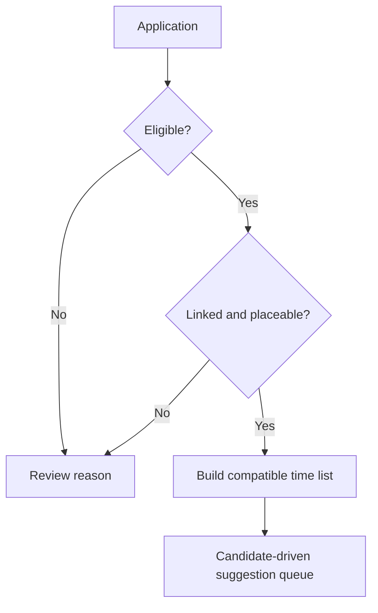

:::

## What the suggestion engine receives

<figure class="castle-screenshot castle-screenshot--wide">
  
  <figcaption>The diagrammed rules operate on the real planner data shown here: candidate status, score, preferred times, capacity, protected assignments and the editable draft.</figcaption>
</figure>

For one stage, the engine receives the active position columns and their UTC cells, the capacity of each cell, candidates, their stage score/rank, their time choices, player link, status, eligibility result, permitted positions, existing protected entries and the configured strategy. It uses a candidate’s selected UTC times, explicit alternatives, unavailable times, `any available time` choice, configured score and submitted time.

It does **not** treat an unconfigured resource as a universal disqualification, invent availability, create a player link, change an application status, or decide that an application should be accepted. Resource information matters only through the stage’s configured eligibility rules and ranking weights. True Gold is an amount; speedups are durations. General Speedups are allocated into the relevant speedup categories before a score is calculated, so the General pool is not counted a second time.

## Automatic eligibility funnel

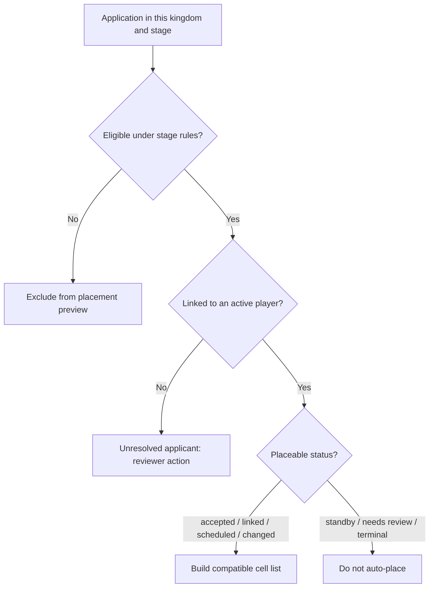

An applicant must be eligible, linked to a player and in one of the placeable statuses: **accepted**, **linked**, **scheduled**, or **changed**. Standby and needs-review rows remain visible to the reviewing team, but do not compete for an automatic placement. Eligibility itself may be unrestricted by default, or narrowed by configured identity, required-field, kingdom/alliance, resource or True Gold rules. Ranking answers “who is stronger among eligible candidates?”; it does not replace eligibility.

## Time compatibility classes

The planner compares UTC slot start times. An explicit unavailable time always wins over any other indication and makes that cell incompatible.

| Class | Meaning | Order in a normal preference list |
| --- | --- | --- |
| Exact | The cell starts at a specifically preferred time | First |
| Alternative | The player explicitly marked the time as acceptable | Second |
| Nearby | The cell falls within the configured nearby-minute window of a preferred or alternative time | Third, nearest first |
| Any | The player chose any available time | Last |
| None | Unavailable or not selected/tolerated | Never proposed |

The default nearby window is **60 minutes**, but an administrator can request 0–720 minutes for a suggestion calculation. Nearby means either earlier or later within that symmetric UTC range; the nearer cell is preferred. The algorithm does not separately prefer “one hour before” or “one hour after.” Because comparisons use actual UTC timestamps, crossing midnight is simply another earlier/later UTC interval; local device timezone never changes the decision.

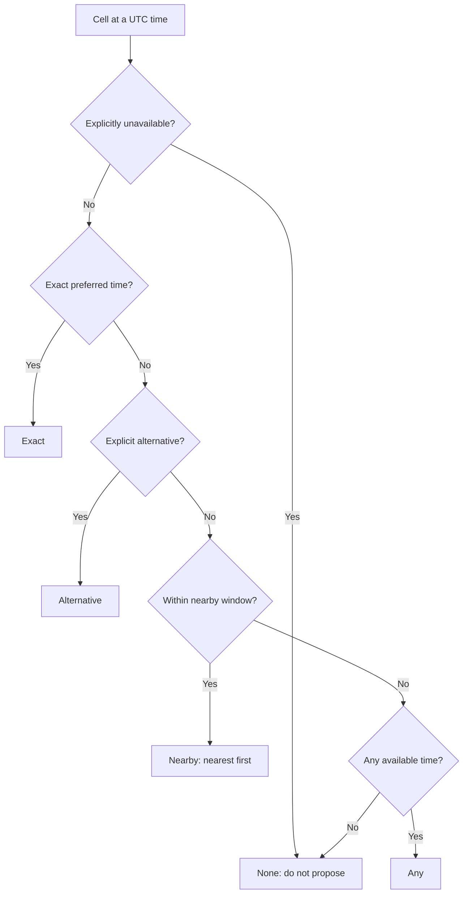

## Exact decision sequence

1. **Build cells.** The system reads each active stage position and its slot times/capacity. A candidate is limited to their permitted position list when one exists. Administrators see the resulting board; they can change configuration before recalculating.
2. **Preserve protected entries.** Locked assignments, manual-player entries and reserved notes consume their cell capacity first. The engine never displaces them. An administrator can alter such an entry through normal planner controls, not through suggestion recalculation.
3. **Filter candidates.** Only eligible, linked, placeable candidates enter the calculation. Ineligible or unresolved rows are excluded with a review reason. A reviewer may resolve the cause and recalculate.
4. **Create each candidate’s ordered list.** The system removes prohibited positions and incompatible times, classifies the rest, then orders them by the selected strategy. The candidate’s list is visible through suggestion reasons/trace, not a hidden final decision.
5. **Start strongest-first proposals.** Candidates enter a queue ordered by the strategy’s contest comparison. Each candidate proposes to their next untried compatible cell. A candidate/cell pair is never tried twice, which prevents cycles and keeps the preview deterministic.
6. **Reject overlapping appointments.** A player cannot take a cell that overlaps an appointment they already hold, whether that appointment is protected or another suggested placement. The planner records an overlap block and tries the next compatible choice.
7. **Use free capacity or contest a holder.** If capacity remains after protected and suggested occupants, the candidate is placed. If the cell is full of protected entries, it cannot yield. If it contains suggested occupants, the candidate competes with the weakest suggested holder.
8. **Displace only when stronger.** A stronger challenger replaces the weakest suggested holder. The displaced applicant resumes from the next untried preference; they do not restart. If the challenger is not stronger, they try their next choice.
9. **Finish with an explanation.** The preview returns placements, unplaced candidates, metrics and an administrator-facing trace: free-cell placement, contested win, displacement, protected block, stronger block, overlap block or exhausted options.
10. **Human schedule lifecycle.** An authorised King or Minister reviews the result, edits the draft if needed, saves it, resolves any finalisation checks, finalises it, then publishes it. A later change requires reopening and publishing a new version.

## Strategy comparison

| Strategy | Primary goal | Main comparison | Secondary comparison | Tie-break | Best use |
| --- | --- | --- | --- | --- | --- |
| `BALANCED` (default) | Respect stated choices while retaining strong candidates | Higher stage score wins a contest | Better time class | Fewer named usable choices, earlier submission, application ID | Ordinary kingdom planning |
| `HIGHEST_SCORE` | Seat strongest candidates first | Higher stage score wins a contest | Better time class only after score | Fewer named choices, earlier submission, application ID | A stage where score matters more than exact requested time |
| `BEST_TIME_MATCH` | Maximise exact/closer time matches | Better time class wins a contest | Higher stage score | Fewer named choices, earlier submission, application ID | A stage where attendance fit outweighs a score difference |

These strategy values are accepted by the suggestion request and used by the planner code/tests. The current planner request has a strategy field; whether a particular interface exposes all choices depends on the installed management surface. They are not player-facing application choices.

For `BALANCED` and `HIGHEST_SCORE`, the stage recommendation score is the primary contest signal. `BEST_TIME_MATCH` reverses those first two contest comparisons. In every strategy, a smaller scarcity count wins after the principal comparisons: a candidate with one named option is treated as more constrained than a candidate with several. `Any available time` is treated as maximally unconstrained. If still tied, the earlier application submission wins; if times are equal, the stable application ID ends the tie. This final ID tie-break means reordering the input does not change the result.

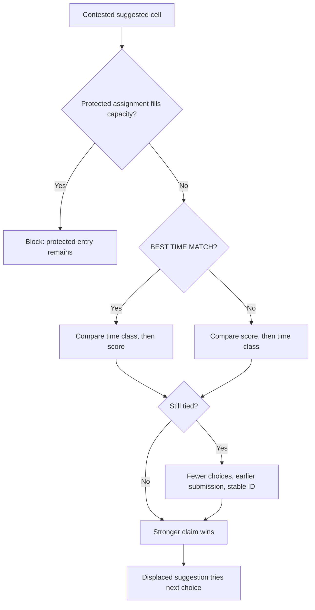

## Capacity, locks, duplicates and overlaps

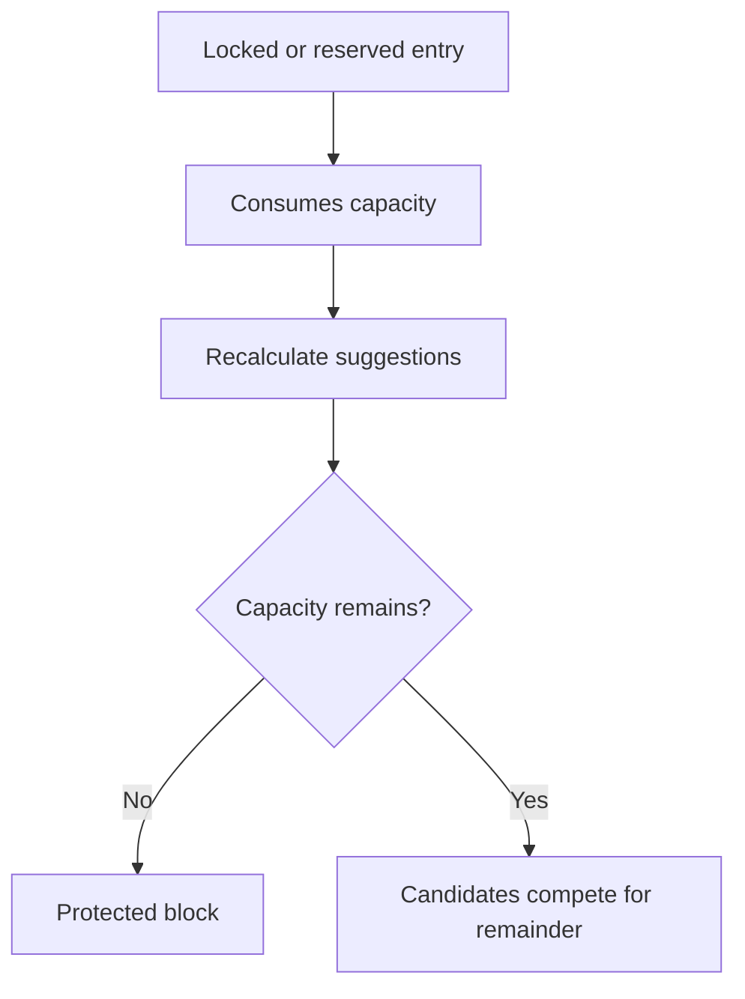

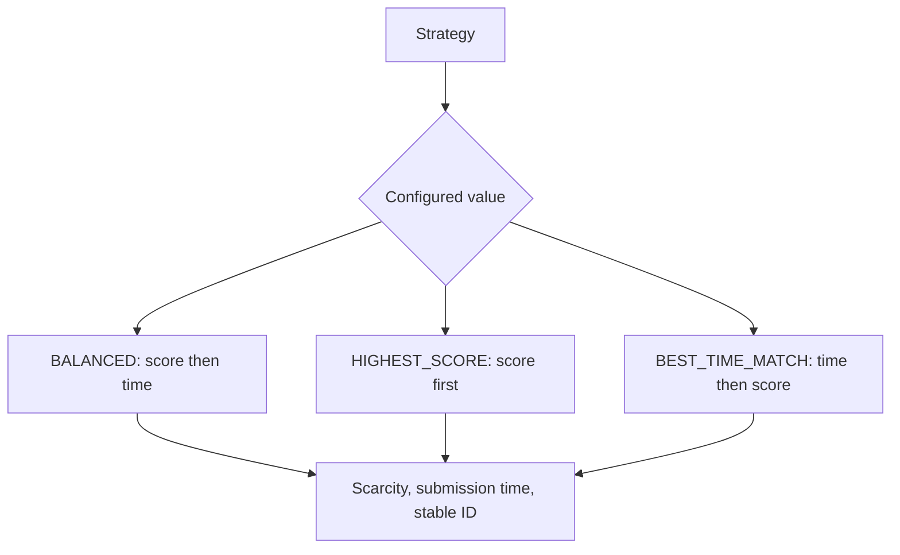

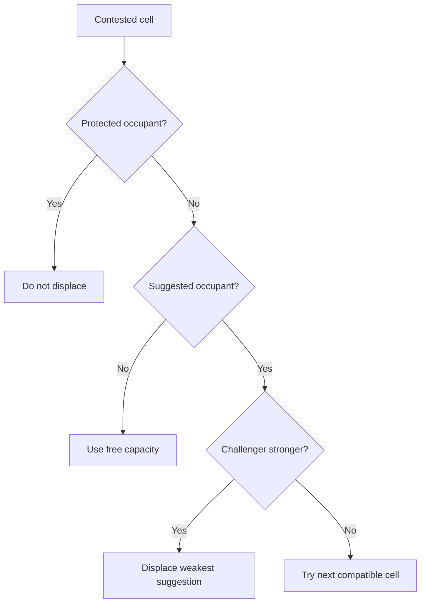

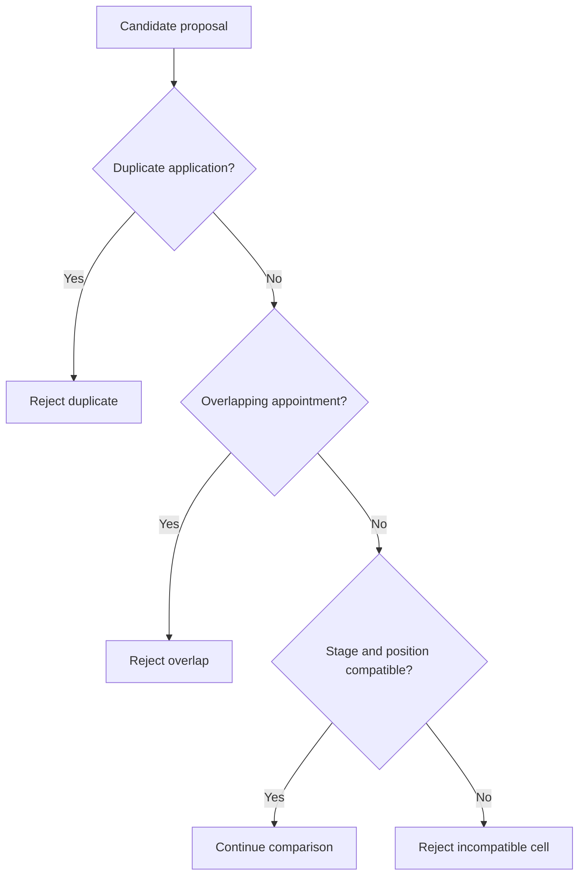

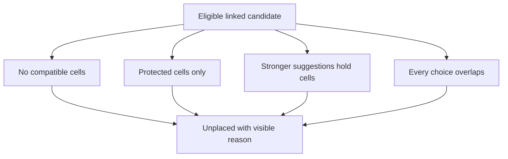

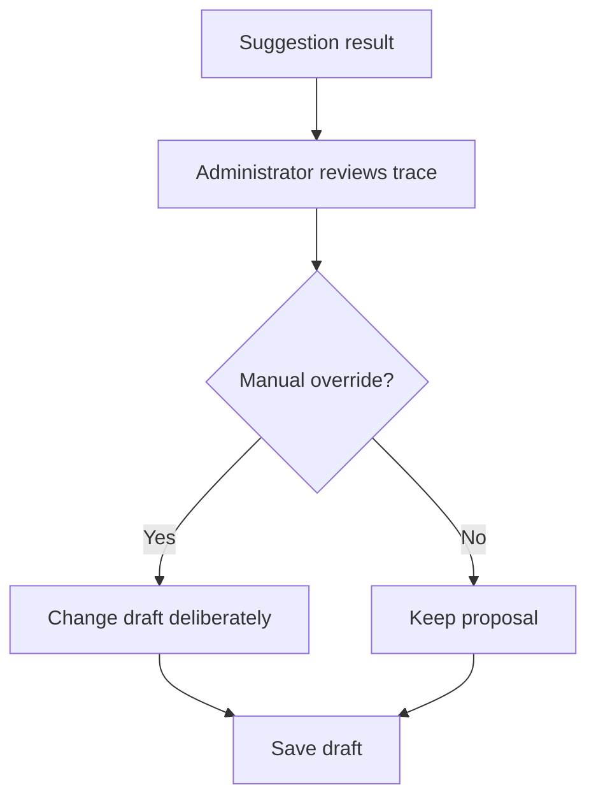

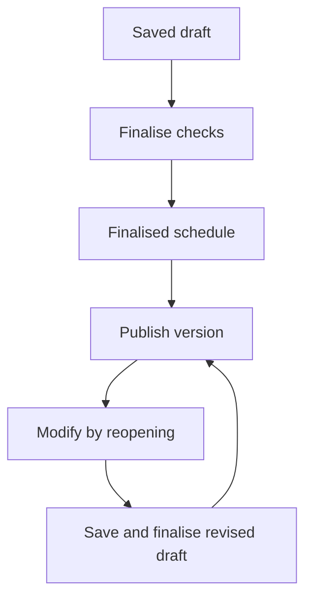

A cell’s configured capacity is the number of appointments it can hold at that position/time. Protected entries consume capacity before suggestions. If capacity is two and one protected entry exists, only one suggestion can occupy it. The planner can displace a **suggested** occupant, never a protected one.

The preview prevents the same application from being simultaneously suggested twice because an application has one current assignment and resumes only after displacement. Saving adds stronger structural checks: the same grid cell cannot be submitted twice, an application can occur only once in a stage, a manual player can occur only once in a stage, and one player cannot have overlapping appointments across position columns. Manual placement also confirms that the player is active and belongs to the kingdom.

## Preferences, gaps and unplaced results

The live engine deliberately honours stated preferences rather than pulling a candidate into an earlier tolerated slot just to create a visually uninterrupted column. This means a suggestion can leave an earlier cell empty while a later requested cell is suggested. The planner reports the gap instead of silently changing the request. Finalisation still checks that the saved board is structurally acceptable, so an administrator may need to move an appointment, use a placeholder/reservation, or make another deliberate choice before finalising.

An eligible linked candidate can remain unplaced for one of these visible reasons: no compatible cell exists, every compatible cell is held by a stronger suggestion, every compatible cell is protected, or every compatible choice would overlap an existing appointment. The correct response is not automatically “override”: review the trace, ask for another time, resolve a status/eligibility issue, use the standby/waitlist process, or make a documented manual decision.

## After publication

The suggestion trace is an administration aid, not a player promise. A saved draft remains editable under schedule rules. Finalisation locks the reviewed version; publishing creates the player-visible version and may trigger conditional notification attempts. If a published appointment changes, reopen the stage, make the revision, save/finalise/publish again, and communicate urgent changes separately where needed. See [Publishing and schedule changes](publishing-and-changes.md) and [Notifications and email](notifications-and-email.md).

Next: use [Automatic placement suggestions](automatic-placement.md) for the practical planner workflow, then [Schedule planner](schedule-planner.md) to save and publish safely.
