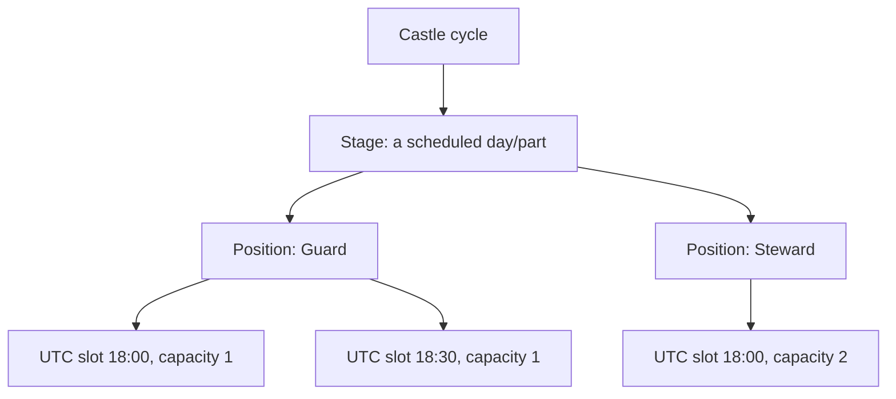

# Stages, positions, slots and resources

## The hierarchy

A stage has its own date and can contain active positions. Each position is a planner column with its own order, slot count, duration, capacity and, where configured, timing. A stage with no active position cannot be scheduled. A capacity of two means two assignments can occupy the same position/time cell; it does not allow one person to hold overlapping appointments.

**Example:** In the fictional Friday stage, Guard has one 18:00 seat while Steward has two. Three eligible players may be assigned at 18:00 only if they occupy those separate available capacities and none overlap another appointment.

## Configuration procedure

1. Confirm you are in the right kingdom and open the cycle.
2. Set each stage date and UTC timing before planning.
3. Activate the positions required for that stage, then set order, duration, slots and capacity.
4. Configure public/required resource fields and any eligibility or ranking controls.
5. Save and inspect the generated planner grid before opening applications.

::: warning
When a stage has several positions, every saved slot must identify its position. The system does not guess which column an ambiguous old or imported slot belongs to.
:::

## Resources and evaluation

The kingdom chooses which resource fields are visible, required and, where configured, subject to a minimum or used in eligibility/ranking. The application displays values; a configured rule determines whether a value affects eligibility. The system does not claim a universally “best” player without those local settings and reviewer judgment.

| Resource | Meaning |
| --- | --- |
| Construction Speedups | Duration, entered in days; General days may be allocated here |
| Technology Speedups | Duration, entered in days; General days may be allocated here |
| Training Speedups | Duration, entered in days; General days may be allocated here |
| General Speedups | A pool of days that can be allocated across eligible speedup categories; allocations cannot exceed the pool |
| True Gold | A separate amount, not a duration and not part of the General pool |

Resource icons may use the kingdom’s configured default or custom image. Replacing an icon changes the visual aid, not the submitted resource value. Only active public fields are shown to applicants.

## Current limits

The planner needs a stage date and active positions. Legacy schedules may need an administrator to identify the correct position before a multi-position board can save them. Read [Selection algorithm](automatic-placement.md) for how configured eligibility, score and time choices are used, then [Schedule planner](schedule-planner.md).
