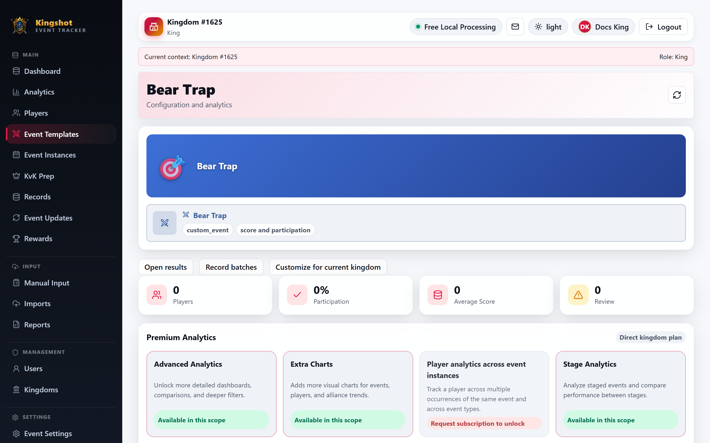

# Bear Trap

Bear Trap is the tracker's default template for the short alliance rally event where players push as much **damage** as they can against the bear.

## How this default is set up

- event style: single-session
- score entry: one score per player
- score label: **Damage**
- score required: yes
- participation tracked: yes

This is a straightforward score event. You normally import one ranking screenshot and review the rows before accepting them.

## What to import

Upload the personal damage ranking screenshot from the event.

There is no stage picker and no cumulative-total behavior here. One session usually means one date and one damage ranking.

## What the results mean

Bear Trap is usually used for:

- top damage rankings
- participation checks
- reward decisions based on damage or attendance

If your alliance also wants to track milestone thresholds, use reward rules or notes around the saved results.

## Good practice

- keep the score label as **Damage** unless your alliance has a very specific reason to rename it
- use one instance per event date
- review unmatched names carefully, because nickname differences are common in rally screenshots

## Protection note

This is a default template, so it is **editable but not deletable**. See [Safety Rules You'll Run Into](../roles/protection-rules.md).

## Related

- [The Default Events](default-events.md)
- [Upload Screenshots](../imports/upload-screenshots.md)
- [Accept Rows (Apply an Import)](../imports/apply-import.md)
