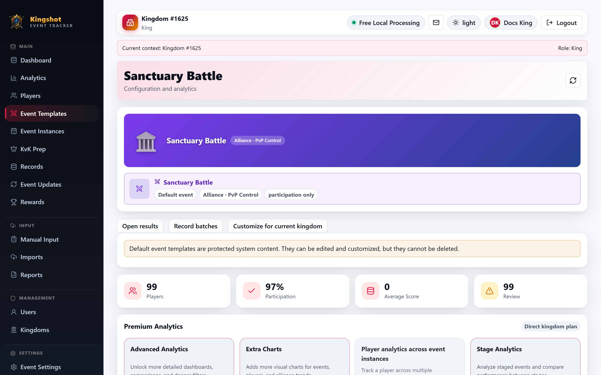

# Sanctuary Battle

Sanctuary Battle is the default template for an alliance **PvP control and occupation** event.

> Warning: Do not treat Sanctuary Battle like Bear Trap. This default is **not** mainly a score race. Participation and control outcome matter first. Score is optional and off by default.

## What this event is for

This template is meant for tracking things like:

- who participated
- whether your alliance won or held control
- reward eligibility tied to attendance or outcome
- optional player-level score only when a useful screenshot actually includes one

## How this default is set up

- event style: single-session
- main tracking style: participation-focused
- score required: no
- score support: optional
- position required: no

The goal is to support a PvP control event without forcing fake score data into it.

## What to import

Import whatever evidence best matches how your kingdom tracks the event:

- participation lists
- outcome notes
- optional player score or combat values, if your screenshot includes them

If you do not have meaningful personal score data, that is fine. You can still track participation correctly.

## What is visible in the interface today

The current event settings interface clearly supports the participation-focused setup and optional score behavior.

The Sanctuary Battle control-event metadata is now also preserved correctly when this template is saved, customized, or accepted through a proposal. The settings page shows that this is a control-focused event and lists the supported control-style capabilities as read-only guidance.

Some deeper control-specific fields still are **not yet editable as separate form controls**. So user-facing setup today should focus on:

- participation
- optional score
- visibility and reward behavior

## Good practice

- decide first whether you are tracking attendance, outcome, or both
- only use score if the screenshot really gives a useful player-level number
- explain your local reward rule clearly so reviewers know what "good" looks like for this event

## Protection note

This is a default template, so it is **editable but not deletable**. See [Safety Rules You'll Run Into](../roles/protection-rules.md).

## Related

- [The Default Events](default-events.md)
- [Configure Event Settings](../how-to/event-settings.md)
- [Participant Eligibility Statuses](../reference/participant-eligibility.md)
