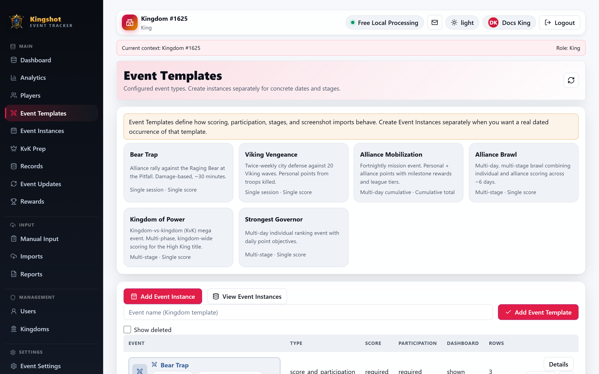
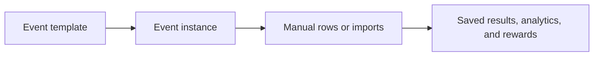

# Event Templates & Instances Explained

Event work in Kingshot Event Tracker starts with two layers:

- an **event template**, which defines how an event works
- an **event instance**, which is one real run of that event on real dates

If you are new to these terms, read [What the Tracker Does](../getting-started/what-is-the-tracker.md) and the [Glossary](../getting-started/glossary.md) first. This page goes deeper on how event pages are used day to day.

## The simple difference

Think of a template as the rulebook and an instance as the match.

- A **template** decides things like score label, whether the event uses stages, whether totals are cumulative, and which import options appear.
- An **instance** is the dated occurrence you actually work inside.
- Results, analytics, and reward checks happen on the **instance**, not on the template itself.

## What templates control

An event template can control:

- the event name, icon, colors, and description
- whether the event is single-session, multi-day, or multi-stage
- whether scores are entered as one score, a cumulative total, or daily changes
- whether score is required, optional, or mostly irrelevant
- whether the event appears in dashboards and analytics
- membership and eligibility rules for who counts in the instance

These settings shape future imports and future instances. They are not meant to rewrite old history.

## What instances control

An instance is where you set:

- the start and end dates
- the current stage, if the event uses stages
- stage dates, if needed
- the actual imported or manual result rows
- lock and unlock state after the event ends

Open **Event Instances** when you want to create or manage real dated runs.

## Common event patterns

The app currently uses three main event patterns:

- **Single-session** events such as Bear Trap and Viking Vengeance
- **Multi-day cumulative** events such as Alliance Mobilization
- **Multi-stage** events such as Alliance Brawl, Kingdom of Power, and Strongest Governor

Sanctuary Battle is a special case: it is mainly a participation and control-tracking event, not a normal score race. See [Sanctuary Battle](sanctuary-battle.md).

## Default templates and custom templates

The tracker starts with seven seeded default templates. See [The Default Events](default-events.md) for the list.

Important:

- default templates can be edited
- default templates can be customized into kingdom or alliance versions
- default templates cannot be deleted

That protection rule is explained in [Safety Rules You'll Run Into](../roles/protection-rules.md).

## Where to go next

- [The Default Events](default-events.md)
- [Create a Custom Event](../how-to/create-custom-event.md)
- [Edit an Event Template](../how-to/edit-event-template.md)
- [Create an Event Instance](../how-to/create-instance.md)
