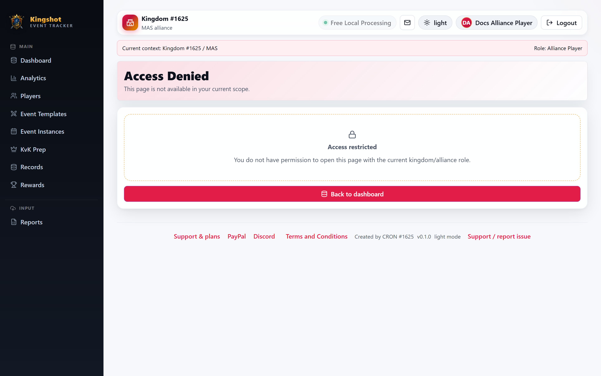

# "You don't have access" — What It Means

Sooner or later you'll try to open a page or press a button and the app will tell you that you don't have access. This is normal and, almost always, working as intended. This guide explains why it happens and what to do.

## Why it happens

Every page and action in the app is tied to a [role](../roles/overview.md) and a [scope](glossary.md#scope). If your role doesn't include a particular ability — or the thing you're trying to reach is outside your kingdom or alliance — the app stops you rather than showing or changing data you shouldn't touch.

This is a feature, not a fault. It keeps one alliance from editing another's data, and stops accidental changes to platform‑wide settings.

## The common situations

| What you see | What it usually means | What to do |
|---|---|---|
| A menu item is simply **not there** | Your role doesn't include that area | Nothing's wrong; you don't need it for your role |
| An **"access denied" / forbidden** page after clicking a link | You reached a page your role can't open (e.g. an old bookmark) | Go back to your [dashboard](dashboard-tour.md) |
| **"You cannot delete your own account"** | A safety rule is protecting you | Ask another admin if the account really must go — see [Safety Rules](../roles/protection-rules.md) |
| **"At least one active supreme admin must remain"** | You're trying to remove the last top‑level admin | This is blocked on purpose; appoint another first |
| **"You can only delete users that you created"** | A King can only remove accounts they made | Ask the Supreme Admin to handle it |
| A "scope" style refusal (kingdom/alliance) | You tried to view or change something outside your area | Confirm your [context](navigating.md#the-context-banner--knowing-where-you-are); you likely don't have rights there |
| Something is **locked** and won't save | The event instance is locked (usually because it ended a while ago) | You can request it be unlocked — covered in the events section |
| A **quota / suspension** message | Your kingdom or alliance hit a limit or was paused | See the subscriptions section; a King or Supreme Admin can help |

Several of these are **safety rules** — deliberate guardrails. The full list is in [Safety Rules You'll Run Into](../roles/protection-rules.md).

## Is this a bug?

Usually not. Before assuming something's broken:

1. **Check your context banner** — are you in the right kingdom/alliance?
2. **Check your role** — the [roles overview](../roles/overview.md) lists what each role can do.
3. **Try from your dashboard** — a stale link or bookmark can point at a page you can't open.

## Who to ask

- **Need access you don't have?** Ask the person one level up: an Alliance Player asks a Leader; a Leader asks their King; a King asks the Supreme Admin.
- **Think your role is wrong?** Only admins can change roles. Ask your King or Supreme Admin to review your [assignment](glossary.md#assignment).
- **Blocked by a safety rule?** Read [Safety Rules You'll Run Into](../roles/protection-rules.md) first — most of the time the block is correct and there's a proper way around it.
