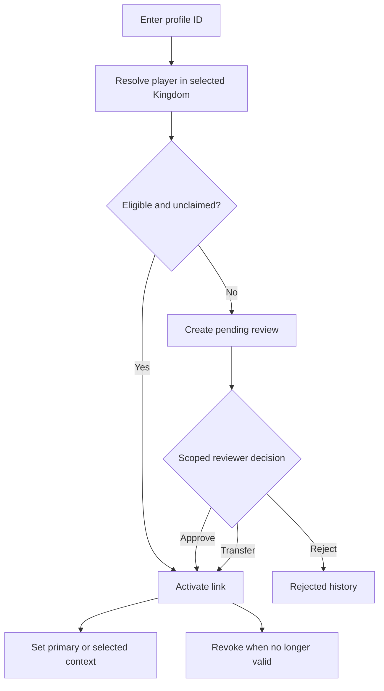

# Account Security, Role Requests, and Player Links

Accounts now separate four concepts:

1. your login identity;
2. your active sessions;
3. your approved role assignments;
4. your linked Kingshot player profiles.

## Sessions

Open your profile to review signed-in sessions.

You can:

- revoke one unfamiliar device;
- log out every other session;
- log out all sessions, including the current one.

Sessions expire according to the platform security policy. Role, assignment, and permission changes take effect without forcing you to sign in again. Explicit account-security actions can end a session sooner.

## Forgotten password

The reset process uses a one-time email link.

1. Open **Forgot password**.
2. Enter the requested account lookup.
3. Submit the request.
4. Open the email link when it arrives.
5. Choose a new password before the link expires.

Your deployment may require administrator approval before sending the link. The public page does not confirm whether the account exists.

## Role requests

Registration can activate your account as an Alliance Player while a higher requested role is reviewed.

Possible states:

- **Active:** no role review is needed.
- **Active, role review pending:** you can sign in with the temporary role.
- **Pending registration approval:** an administrator must approve the account itself.
- **Needs more information:** the reviewer requires clarification.
- **Rejected:** the registration or role request was declined.

A role reviewer chooses the final role and target scope. Users cannot approve their own requests.

## Linked player profiles

One account can link to more than one Kingshot player.

Each link can be:

- pending;
- active;
- rejected;
- revoked.

The primary link is the account's default identity. The selected context controls which active player is used for personal pages during the current workflow.

### Why a link can be pending

A link enters review when:

- another account already claims the player;
- the source workflow requires verification;
- the Kingdom or player record is not eligible for immediate activation.

The review protects personal analytics, Castle Position applications, and player-specific records from attaching to the wrong account.

## What the selected player affects

The selected player can drive:

- personal analytics;
- player dashboard data;
- reward progress;
- event readiness;
- Castle Position status;
- other player-specific pages.

Changing selected context does not merge player records.

## If something is wrong

- Revoke a link that no longer belongs to you.
- Ask a scoped administrator to review a pending conflict.
- Do not create a second platform account to work around an existing claim.
- If a deleted player is involved, ask the administrator to repair the player record first.

## Related

- [Request an Account](registering.md)
- [Reset a Forgotten Password](forgot-password.md)
- [Edit Your Profile and Password](your-profile.md)
- [Player Profile](../how-to/player-profile.md)
