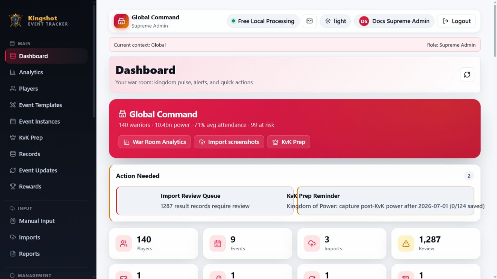
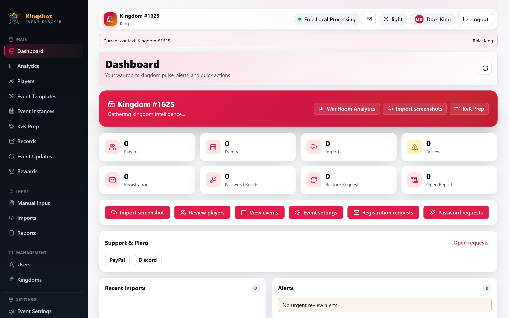
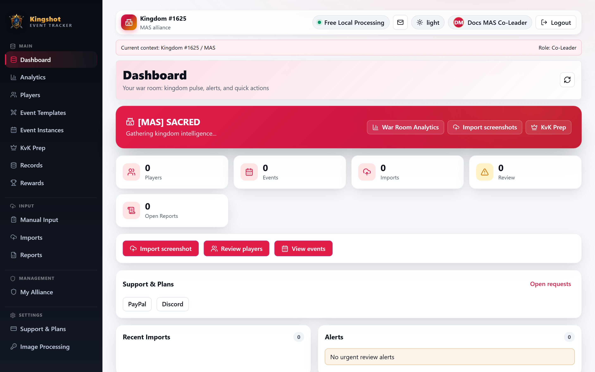
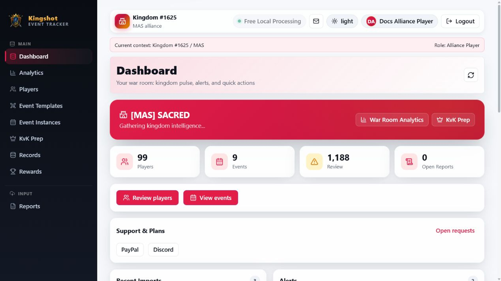

# Reading the Dashboard

The dashboard is your home screen — the first thing you see after logging in. It's a summary: recent activity, key numbers, and charts for the part of the platform you're responsible for. What appears depends on your [role](../roles/overview.md) and your current [context](glossary.md#context-context-banner).

## What's on the dashboard

Most dashboards include some mix of these:

- **Headline stats** — quick counts and figures (players, events, recent results, and similar) for your kingdom or alliance.
- **Kingdom Pulse** — a snapshot of how your kingdom or alliance is doing overall: activity and momentum at a glance.
- **Charts** — visual trends drawn from your recorded results, so you can spot who's rising, falling, or missing.
- **KvK Prep alerts** — reminders and warnings tied to Kingdom‑vs‑Kingdom preparation, when relevant, so nothing slips before a big event.

## How the dashboard changes by role

The dashboard shows you *your* slice of the platform — no more, no less:

- **Supreme Admin** — a platform‑wide view spanning all kingdoms.
  
- **King** — the whole of *their* kingdom: its alliances, players, and events.
  
- **Alliance Leader / Co‑Leader** — *their* alliance's players, events, and trends.
  
- **Alliance Player** — a read‑only view of the alliance data they're allowed to see.
  

If your dashboard looks emptier than a colleague's, it usually just means your role has a narrower scope — not that data is missing.

## Reading it well

- **Numbers feel off?** Check your [context banner](navigating.md#the-context-banner--knowing-where-you-are) first. The dashboard only reflects your current kingdom/alliance.
- **A chart is empty?** There may simply be no recorded results yet for that period. Once events are imported or entered, charts fill in.
- **Want more detail?** The dashboard is a summary. Use **Analytics**, **Players**, and **Event Instances** in the sidebar to drill in.

## Where to go next

- [Finding Your Way Around](navigating.md) — the sidebar and top bar.
- [Roles Explained](../roles/overview.md) — why your view differs from someone else's.
