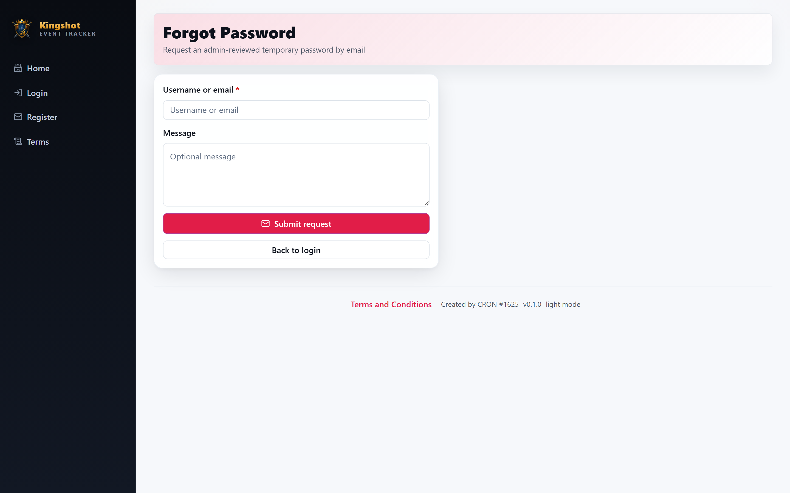

# Reset a Forgotten Password

If you can't remember your password, you can ask for it to be reset. **This app does not send an automatic reset link** - instead, an admin reviews and approves your request. That keeps accounts secure in a shared kingdom.

## Requesting a reset

1. On the login screen, choose **Forgot password**.
2. Enter the details asked for (such as your username or email).
3. Submit the request.

Your request now goes to your kingdom's admins. You'll keep using your old password until the reset is approved (or you'll be given a new temporary one).

## What happens next

- An admin (Supreme Admin or King) sees your request in their **Password Requests** list.
- They either **approve** it - after which you'll be able to sign in with a new or temporary password - or **reject** it if something doesn't look right.
- Once approved, log in and, if prompted, set a new password of your own on the [profile page](your-profile.md).

## Why there's no instant email link

Because kingdoms share administration, password resets are handled by a trusted person rather than automatically. This prevents someone from resetting an account that isn't theirs. The trade‑off is that a reset takes a little longer - it depends on an admin being available.

## If you're in a hurry

- Contact your Alliance Leader or King directly and let them know you've filed a reset request.
- Double‑check you're using the right username first - sometimes it's not the password that's the problem.

## Related

- [Log In & Out](logging-in.md) - including the "too many attempts" cooldown.
- [Edit Your Profile & Password](your-profile.md) - changing your password once you're in.
