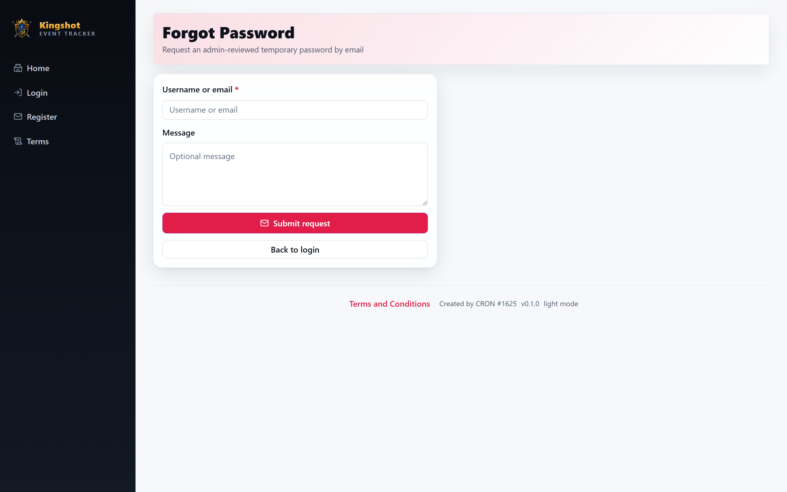

# Reset a Forgotten Password

If you cannot remember your password, request a one-time reset link. A deployment can send the link through self-service or require an administrator to approve the request first.

## Requesting a reset

1. On the login screen, choose **Forgot password**.
2. Enter the details asked for (such as your username or email).
3. Submit the request.

The public response does not confirm whether an account exists. If the request is eligible, the next step depends on the deployment's reset mode.

## What happens next

- **Self-service mode:** the system emails a one-time reset link to the eligible account.
- **Administrator approval mode:** an authorized administrator reviews the request and then sends the one-time link or rejects the request.
- Open the link within one hour and choose a new password.
- A used, expired, or revoked link cannot be reused.

## Why approval can be required

Some communities keep administrator review enabled because the account identity may need manual verification. The public form still avoids account enumeration, and the email link remains one-time.

## If you're in a hurry

- If approval is enabled, contact the authorized account administrator and mention that you filed a request.
- Double‑check you're using the right username first - sometimes it's not the password that's the problem.

## Related

- [Log In & Out](logging-in.md) - including the "too many attempts" cooldown.
- [Edit Your Profile & Password](your-profile.md) - changing your password once you're in.
- [Account Security, Role Requests, and Player Links](account-security-and-player-links.md)
