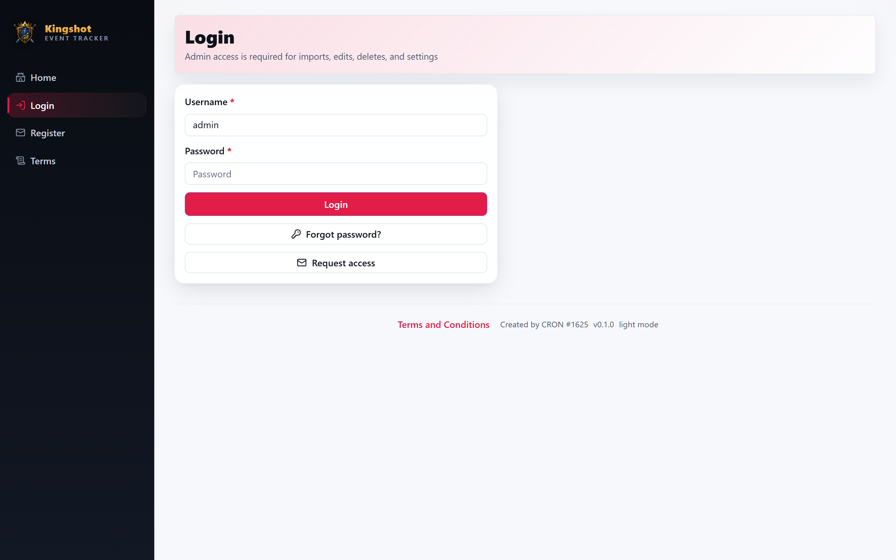

# Log In & Out

This guide covers signing in, what to do if the login screen stops accepting attempts, and signing out.

## Logging in

1. Open the app in your web browser.
2. On the login screen, enter your **username** and **password**.
3. Select **Log in**.

If your details are correct, you land on your [dashboard](dashboard-tour.md). What you see there depends on your [role](../roles/overview.md).

## If you don't have an account yet

You can't create your own account from the login screen alone — accounts are approved by an admin. See **[Request an Account](registering.md)**. If your kingdom doesn't allow self‑registration, ask your King or Alliance Leader to create your account for you.

## If you forgot your password

Use **[Reset a Forgotten Password](forgot-password.md)**. There is no automatic "reset link" email — an admin approves your reset request.

## "Too many attempts" — the login limit

For security, the login screen only allows a handful of tries in a short window. If you get the password wrong several times in a row, logins are **temporarily blocked** for a short cooldown period.

If this happens:

- **Wait** a little while before trying again — the block lifts on its own.
- Don't keep hammering the login button; repeated failures just extend the wait.
- If you truly can't remember your password, use [Reset a Forgotten Password](forgot-password.md) instead of guessing.

## Logging out

Select **Logout** in the top‑right corner of the app (next to your name). This ends your session on that device. Always log out on shared or public computers.

## Trouble getting in?

- **"You don't have access" after logging in** — you're logged in fine, but your role doesn't allow that page. See ["You don't have access"](access-denied.md).
- **Account seems inactive or missing** — your account may be waiting for approval or may have been disabled. Contact your King or Supreme Admin.
