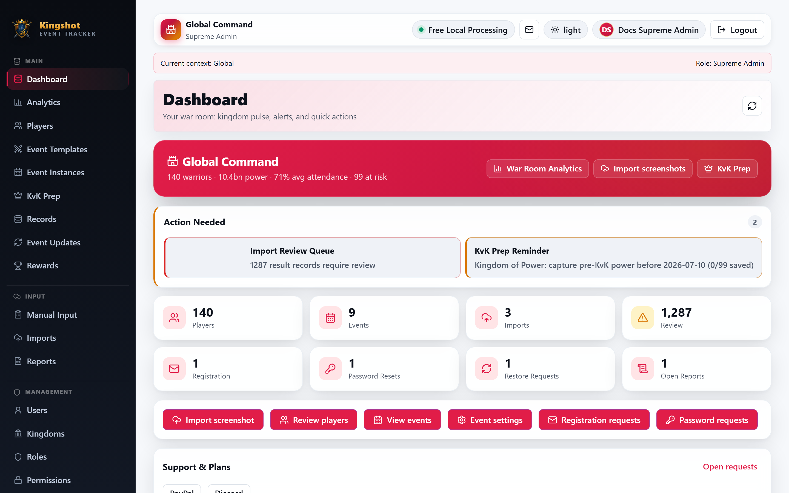
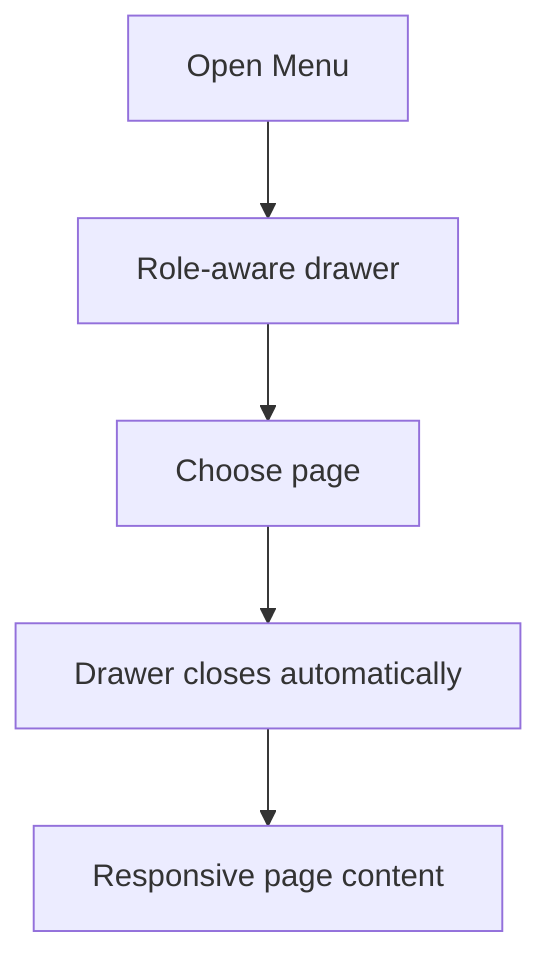

# Finding Your Way Around

Once you're logged in, the app has three main areas: navigation, the top bar, and the main work area. What you see is shaped by your [role](../roles/overview.md) - lower roles simply have fewer menu items.

The capture above is a sanitized navigation reference. On smaller screens the same role-aware entries move into the Menu drawer; the navigation flow below explains the responsive difference without exposing a live account or activity data.

## Desktop navigation

On desktop, the sidebar appears on the left and groups pages into sections. You'll only see the sections your role can use, so your sidebar may be shorter than a colleague's - that's normal, not a bug.

| Section | What lives here | Who typically sees it |
|---|---|---|
| **Main** | Dashboard, Analytics, Players, Event Templates, Event Instances, KvK Prep, Records, Rewards | Everyone (view-only for Alliance Players) |
| **Input** | Manual Input, Imports, Reports | Roles that can enter or upload data |
| **Management** | Users, Kingdoms, **My Alliance**, Roles, Permissions | Kings, Leaders, Supreme Admins |
| **Settings** | Event Settings, Player Attributes, Reward Rules, Support & Plans, Image Processing, Email, Theme | Depends on the setting; some are admin-only |
| **Admin** | Registration/Password/Restore requests, Logs, Icons, Recycle Bin, Subscriptions & Usage, Support Links, Processing Services, Platform Console | Senior roles; several are Supreme-Admin-only |

## Mobile and tablet navigation

On phones and smaller tablets, use the **Menu** button at the top-left. It opens a drawer containing the same role-aware navigation as desktop.

No important page is intentionally hidden on mobile. If a page is dense, it may use horizontal scrolling, stacked cards, or a larger-screen recommendation.

## The top bar

The top bar shows:

- current context and processor status;
- Reports shortcut;
- profile and logout controls;
- light/dark theme toggle.

On mobile, some labels collapse so controls stay touch-friendly.

## The context banner

The context banner tells you which kingdom/alliance and role your actions apply to. If a player or event seems missing, check this context first.

## Custom 404 Page & Deep Route Handling

If you navigate to an invalid or unavailable path:
- **Custom 404 Page**: The platform displays a styled 404 NotFound page with direct navigation buttons to return to your active dashboard.
- **SPA Base Path Support**: Navigating under custom deployment paths (such as `/games/kingshot/`) resolves all deep links, static assets, and sub-routes seamlessly.

## Standardized Loading States (`RouteLoading`)

During page transitions and initial data fetching:
- **RouteLoading Indicator**: An animated loading panel communicates active data fetching without layout flickering.
- **LoadingPanel**: Component placeholders preserve page layout structure until server data completes loading.

## Related

- [Mobile & Tablet Guide](../roadmap/mobile-responsive-web.md)
- [Access denied](access-denied.md)
- [Dashboard tour](dashboard-tour.md)
