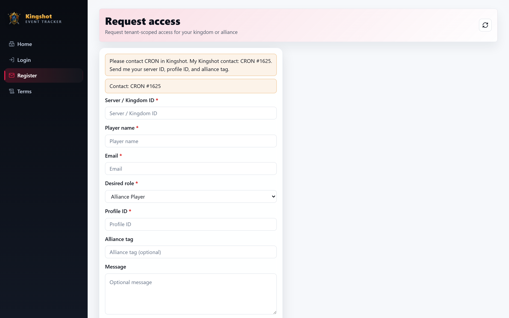

# Request an Account

New members usually join by **requesting an account**, which an admin then approves. This guide walks through the request and what happens next.

> Self‑registration can be turned **off** for a kingdom. If you don't see a way to register, ask your King or Alliance Leader to create an account for you instead.

## Sending a request

1. From the login screen, choose the option to **request an account** (registration).
2. Fill in the form with the details asked for (such as your name and the alliance you belong to).
3. Submit the form.

Your request is now **pending** - it has been sent to your kingdom's admins for review. You cannot log in yet.

Use registration only for a new account. If you already have one, return to login rather than re-entering registration information. A Castle Position application can use its own account/contact choice; that does not make login a new registration.

## What "pending" means

A pending request is simply waiting for a decision. Nobody has rejected you; an admin just hasn't acted on it yet. There are three things that can happen next:

- **Approved** - your account is created and you can log in. You'll be given (or already have) a [role](../roles/overview.md) that sets what you can do.
- **Needs more info** - an admin needs something clarified before deciding. Provide what they ask for so they can continue.
- **Rejected** - the request was declined. If you think that's a mistake, contact your Alliance Leader or King.

## After you're approved

1. Log in with the username and password for your new account (an admin may share a temporary password with you - you may be asked to change it on first sign‑in).
2. Take the quick tour: [Finding Your Way Around](navigating.md) and [Reading the Dashboard](dashboard-tour.md).
3. If a page says you don't have access, that's expected - your role controls what's visible. See ["You don't have access"](access-denied.md).

## Who approves requests

Registration requests are handled by senior roles in your kingdom (Supreme Admin, King, or Alliance Leader). If your request has been pending for a while, a friendly nudge to one of them usually gets it moving.

## Related

- [Log In & Out](logging-in.md)
- [Edit Your Profile & Password](your-profile.md)
- [Roles Explained](../roles/overview.md)
