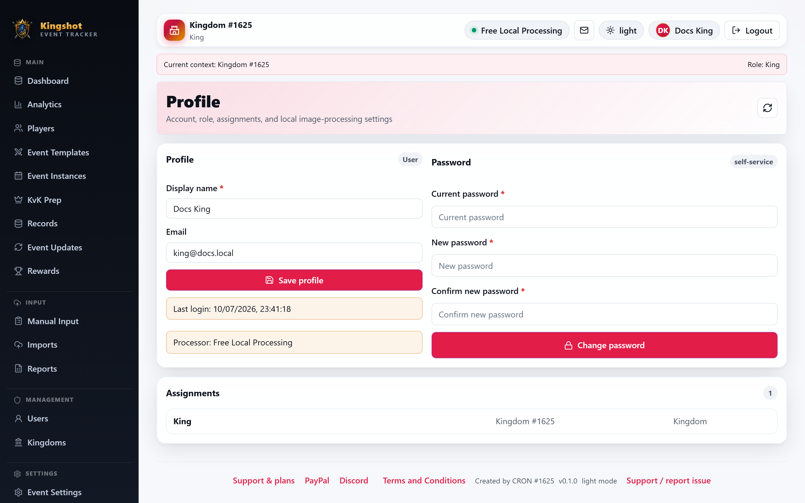

# Edit Your Profile & Password

Your profile is where you update your own display name, email, and password. Every logged‑in user has one, whatever their role.

## Opening your profile

Select your **name** in the top‑right corner of the app to open your profile page.

## Updating your display name and email

1. On the profile page, edit your **display name** and/or **email**.
2. Save your changes.

Your display name is how you appear to others in the app (for example, next to actions you take). Your email may be used for account‑related messages.

## Changing your password

1. On the profile page, find the **password** section.
2. Enter your new password (you may be asked for your current one).
3. Save.

Use a password you don't reuse elsewhere. If you were given a temporary password when your account was created, this is where you replace it with your own.

## If you were forced to change your password

Sometimes an admin creates your account with a temporary password and requires you to set your own the first time you log in. If so, you'll be sent to the password step automatically — just choose a new password and save.

## What you can't change here

- **Your role** — roles are set by admins, not on your own profile. See [Roles Explained](../roles/overview.md).
- **Which kingdom or alliance you belong to** — that's also managed by admins.

If any of those need to change, contact your Alliance Leader, King, or Supreme Admin.

## Forgot your current password?

If you can't sign in at all, use [Reset a Forgotten Password](forgot-password.md) instead — the profile page requires you to already be logged in.
