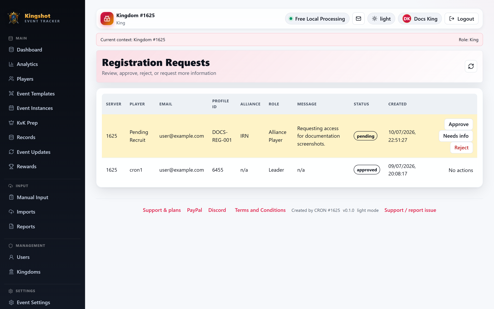

# Approve Registration Requests

Registration requests are for people who asked for access from the public sign-up flow. Your job is to review each request, decide whether it should move forward, and place the new user in the right kingdom, alliance, and role.

## Open the queue

1. Open **Admin**.
2. Select **Registration requests**.

The queue shows the requester's server, player name, email, profile ID, alliance tag, requested role, message, status, and created time.

## Your three main actions

- **Approve** when the request is valid and ready.
- **Needs info** when you want to pause it and ask for more clarity.
- **Reject** when the request should not be accepted.

## Approve a request

1. Select **Approve** on a pending request.
2. Fill in the approval form.
The form includes **Username**, **Display name**, **Kingdom**, **Alliance** when needed, **Role**, and **Admin note**.
3. Select **Approve and create user**.

What happens next:

- The user account is created.
- The assignment is created at the same time.
- A temporary password is generated automatically.
- If the request has an email address, that temporary password is emailed once to the requester.
- The new user is forced to change it at first login.

## When to use "Needs info"

Use **Needs info** when the request is probably real but something important is unclear, such as:

- the wrong kingdom
- a missing alliance choice
- the wrong requested role
- a message that needs manual checking

## When to reject

Reject when the request should not be admitted. Keep the reasoning clear in your admin note if your team needs an audit trail later.

## Good practice

- Match the role to the smallest access the person really needs.
- Check whether the player belongs to a specific alliance before choosing the assignment.
- If someone already has an account, do not approve the request as a brand-new user. Update the existing account instead.

## Related

- [Request an Account](../getting-started/registering.md)
- [Create a User](create-user.md)
- [Assign or Remove Roles](assign-roles.md)
