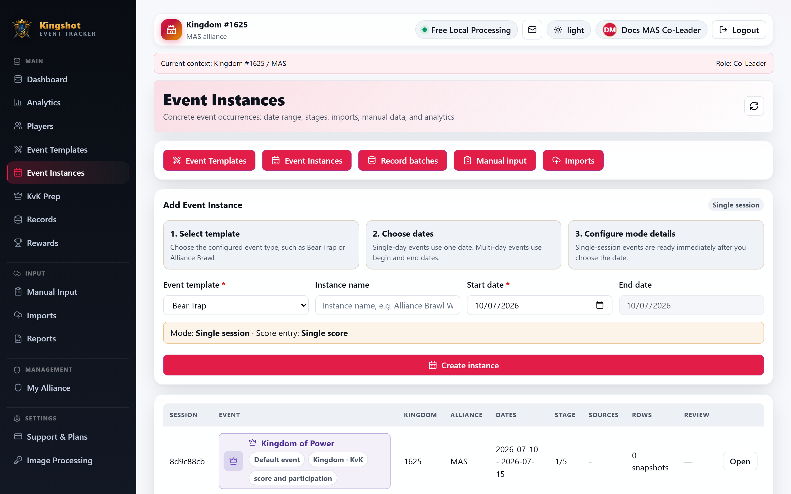

# Create an Event Instance

Create an event instance when you want a real dated run of a template that can hold manual rows, screenshot imports, analytics, and rewards.

## What you choose when creating one

The **Add Event Instance** form lets you set:

- the event template
- an optional instance name
- start and end dates
- stage count and current stage, if the event uses stages
- stage dates, if the event uses stages
- whether total points stack across stages for staged events

## Basic workflow

1. Open **Event Instances**.
2. Choose the template.
3. Set the date range.
4. If the event uses stages, confirm the stage count and dates.
5. Select **Create instance**.

After saving, the app opens the new instance.

## How different event types behave

- **Single-session** events usually use one start date and one end date.
- **Multi-day cumulative** events use a window, then store dated snapshots inside that window.
- **Multi-stage** events let you define stages and stage dates up front.

## Helpful hints from the page

The create page also shows:

- a quick explanation of the selected event mode
- recent previous dates for the same template
- a stage timeline preview for staged events

## Related

- [Event Templates & Instances Explained](../events/templates-overview.md)
- [Work Inside an Instance](instance-detail.md)
- [Run a KvK Prep Session](kvk-prep.md)
