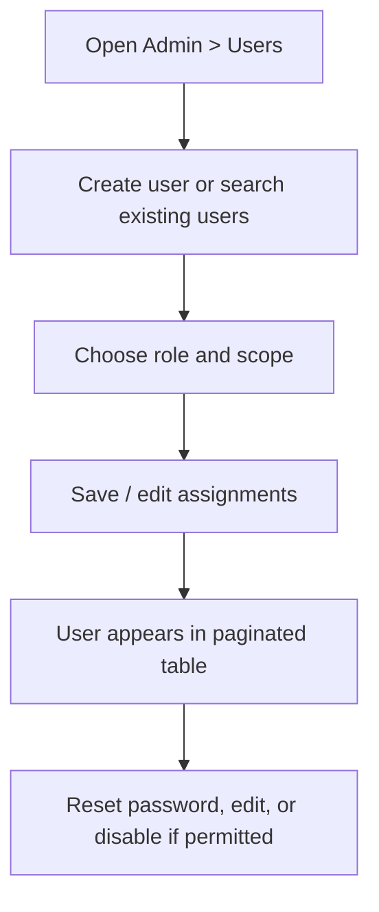

# Create and Manage Users

Users are managed from the Admin page when your role has user-management permission.

## What changed in the responsive pass

The Users section is now a full-width management view instead of being squeezed beside logs. It includes:

- clear **Create user** section;
- clear **Find and sort users** toolbar;
- pagination;
- page size selector;
- role, kingdom, alliance, status, presence, and password-state filters;
- sorting by username, email, role, scope, created date, last login, and last seen;
- readable horizontal table on smaller screens;
- protected destructive actions.

## Basic flow

## Mobile/tablet guidance

- Use filters first; then scroll the table horizontally if needed.
- Bulk/danger actions are easier on tablet or desktop.
- Self-delete and last-supreme-admin protections still apply.

## Visual reference

The redesigned list uses the same clear hierarchy: filters and sorting precede results, role and scope are badges rather than dense prose, and destructive actions live in an actions menu.
