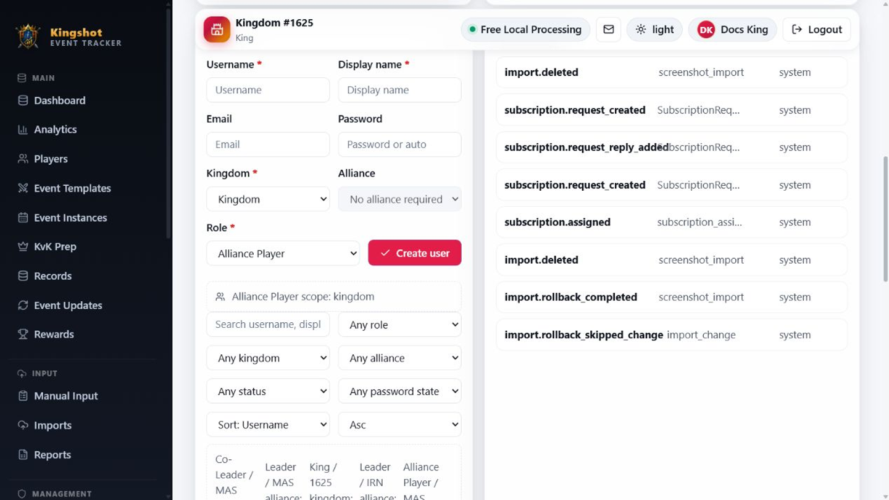

# Create a User

Use the **Users** panel when you need to create an account for someone instead of waiting for them to register on their own. This is usually how a `Supreme Admin` or `King` sets up access for a new helper, leader, or `Alliance Player`.

## Before you start

- Make sure you know which kingdom or alliance this person belongs to.
- Pick the right role label before you save: `Supreme Admin`, `King`, `Alliance Leader`, `Co-Leader`, or `Alliance Player`.
- If you are a `King`, you can only create users inside the part of the system you manage.

## Create the account

1. Open **Admin**.
2. Find the **Users** section.
3. Fill in **Username** and **Display name**.
4. Add **Email** if the user should receive password emails.
5. Choose a **Password** only if you want to set one yourself.
6. Choose the user's **Kingdom**, **Alliance**, and **Role**.
7. Select **Create user**.

## How the password works

- If you type a password, that password is saved for the new user.
- If you leave **Password** blank, the system creates a password internally and marks the account to change it at first sign-in.
- This page does not show or email that generated password back to you.

Because of that, the safest workflow is usually one of these:

- Set a starting password yourself and tell the user privately.
- Or create the user with an email address, then use the reset flow to send a one-time temporary password by email.

## Choosing the right scope

- `Supreme Admin` is a global account. It does not need a kingdom or alliance.
- `King` belongs to a kingdom.
- `Alliance Leader`, `Co-Leader`, and `Alliance Player` belong to an alliance.

If the role needs a kingdom or alliance, the form requires it before it will save.

## What happens next

- The account appears in the user list right away.
- From there you can open the profile, change details, add more assignments, or reset the password.
- If the new person should manage more than one place, add those extra assignments after the account is created.

## Related

- [Edit a User & Reset Their Password](edit-user.md)
- [Assign or Remove Roles](assign-roles.md)
- [Roles Explained](../roles/overview.md)
- [Request an Account](../getting-started/registering.md)
