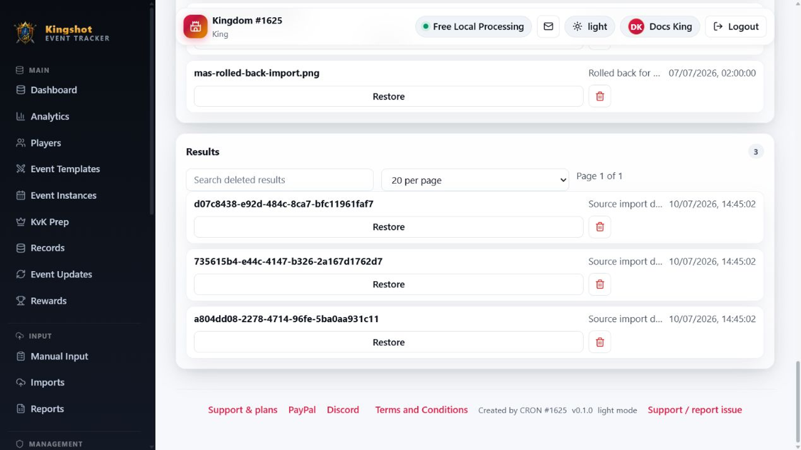

# Delete & Restore Kingdoms/Alliances

Deleting a kingdom or alliance does not immediately erase it forever. It moves into the recycle-bin flow, where it stays out of normal views and analytics until it is restored or later purged.

## Before you delete

- Make sure you really want to hide the whole kingdom or alliance from normal use.
- If you only need to fix users or players, use those smaller tools instead.
- Check the recycle-bin rules first so you know who can restore it afterward.

For the general idea behind deletion in this app, read [What "Delete" Really Does](../reference/soft-delete.md).

## Delete a kingdom

1. Open the kingdom page.
2. Use the delete action in the page header.
3. Confirm the delete.

## Delete an alliance

You can delete an alliance from:

- the alliance row on the kingdom page
- the alliance detail page

After confirmation, it moves out of normal views and into the recycle bin.

Some alliance deletions can be blocked by ownership or subscription protections. If that happens, resolve the blocking condition first and try again.

## Restore from the recycle bin

1. Open **Recycle Bin**.
2. Go to the **Kingdoms** or **Alliances** section.
3. Find the deleted item.
4. Select **Restore** if you have restore permission.

If you do not have restore permission but can file reports, use **Request restore** instead.

## What restore gives back

Restore brings the kingdom or alliance back into normal views. It does not replace the need to check:

- responsible users
- current players
- recent imports or reports
- any subscription or usage warnings

## Related

- [Use the Recycle Bin](recycle-bin.md)
- [What "Delete" Really Does](../reference/soft-delete.md)
- [Create & Manage Kingdoms](manage-kingdoms.md)
- [Create & Manage Alliances](manage-alliances.md)
