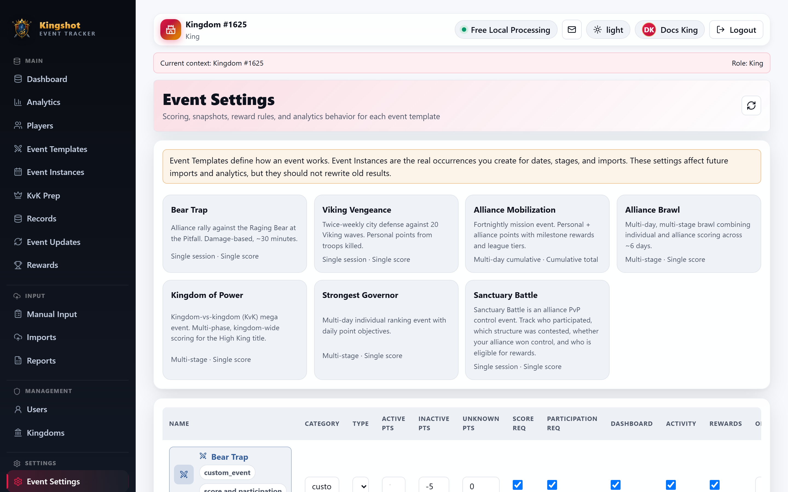

# Configure Event Settings

Use **Event Settings** when you want to control how an event behaves beyond its name and colors.

## What is in the interface today

The page opens as a template manager with:

- total, multi-stage/multi-day, and custom-template summary counts;
- search by event name or category;
- type and duration filters;
- selected-row state;
- Template Library, Configure Event, Score Rules, and Recommended Presets tabs.

The selected event stays active when you move between configuration and rules.

The configuration page lets you edit:

- name, category, icon, badge label, colors, and image URL
- description and instructions
- score label, score unit, and min/max score range
- duration style: single-session, multi-day, or multi-stage
- score entry mode: single score, cumulative total, or daily delta
- default duration in days
- multi-stage defaults such as stage count, stage labels, and whether import requires stage or stage date
- membership snapshot mode
- membership change policy
- new joiner policy
- leave policy
- visibility toggles for dashboard, player analytics, event analytics, activity, and rewards
- score-threshold rules

## Apply a recommended preset

1. Open **Recommended Presets** or choose a preset from the configuration form.
2. Select the matching default event.
3. Apply the preset.
4. Review the copied identity, scoring, stage, membership, visibility, analytics, and reward settings.
5. Select **Save Event Configuration**.

Applying a preset changes the editor state first. It does not bypass review or save automatically.

## Membership and policy settings

These settings decide who counts in an instance and how the tracker reacts when alliance membership changes.

The current interface includes:

- **Snapshot mode**
- **Membership change policy**
- **New joiner policy**
- **Leave policy**

Read [Participant Eligibility Statuses](../reference/participant-eligibility.md) if you want to understand the results these policies can produce inside an instance.

## Multi-stage settings

For multi-stage events, the interface also exposes:

- default stage count
- stage labels
- whether stage selection is required on import
- whether stage date is required on import

This is especially important for events such as Alliance Brawl.

## What is not yet exposed as a separate interface control

Some template-specific settings exist behind the scenes, especially for special templates such as Sanctuary Battle. Those deeper schema-level options are **not yet available in the interface as separate controls**.

What the interface does now do is preserve those special settings correctly when you save, customize, or review a template proposal. For Sanctuary Battle, the page also shows a clearer control-event warning so it is less likely to be mistaken for a normal score race.

So if you were expecting a raw JSON editor or a long list of technical event flags, that is still not the current user-facing design.

## Good practice

- change one event behavior at a time
- save, then create or review an instance to confirm the result feels right
- use the event-specific docs before changing a default template heavily

## Related

- [Edit an Event Template](edit-event-template.md)
- [The Default Events](../events/default-events.md)
- [Participant Eligibility Statuses](../reference/participant-eligibility.md)
